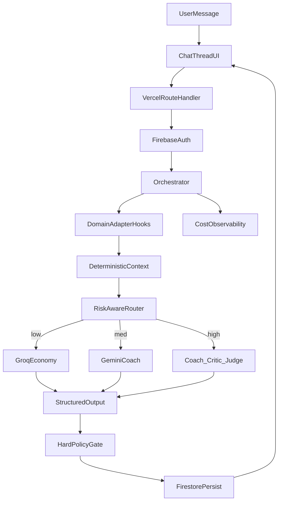

# Layer A — Multi-AI Chat Engine

> Feature Summary / Product-Tech Brief (Prompt v3)  
> Ngày: 2026-09-07 08:52  
> Stack MVP: Next.js + TypeScript + Firebase + Gemini + Groq + GitHub + Vercel

---

## 1. Tóm tắt điều hành

**Layer A — Multi-AI Chat Engine** là nền tảng chat đa model (Gemini + Groq), domain-agnostic, deploy Next.js trên Vercel, lưu Firebase. Engine cung cấp gateway, orchestration Coach→Critic→Judge có giới hạn, memory, cost/observability và **Domain Adapter contract** để gắn bất kỳ dự án nào sau này. ChallengeReady chỉ là vertical/adapter mẫu — không hard-code vào core. MVP: **6 modules**, UI tiếng Việt, keys chỉ server-side.

---

## 2. Mục tiêu & non-goals

### Mục tiêu

- Ship engine chat đa provider dùng lại được cho nhiều dự án.
- Chứng minh gọi 1 model vs 2 model (Gemini + Groq) có kiểm soát cost/latency.
- Định nghĩa contract Domain Adapter để cắm Layer B sau mà không fork engine.
- Đẩy GitHub → Vercel Preview/Prod với Firebase Auth + Firestore.

### Non-goals

- Không làm signal/execution/broker bot.
- Không implement full ChallengeReady (Rule/Risk/Readiness/Training) trong MVP.
- Không FastAPI/PostgreSQL ở phase này.
- Không 8-agent council hay tranh luận vô hạn.

---

## 3. Điểm lệch có chủ ý so với README

| README gợi ý | MVP Layer A |
|---|---|
| FastAPI + PostgreSQL | Next.js Route Handlers + Firebase Auth/Firestore |
| Nhiều provider (OpenAI, Anthropic, Gemini, Groq…) | Tối thiểu **Gemini + Groq** |
| Phase 0 Rule/Risk trước commercial | Engine chat trước; Rule/Risk nằm trong adapter phase sau |
| ChallengeReady = sản phẩm chính | ChallengeReady = **adapter mẫu**; Engine mới là sản phẩm nền |

Vẫn giữ từ README_ChallengeReady_AI.md: thesis multi-agent bounded, structured output, Hard Policy Gate, cost-as-constraint, training/decision-support chứ không prediction/signal.

---

## 4. Danh sách module — Tổng: 6 modules

| # | Module | Job-to-be-done | I/O chính | Mức AI | Ưu tiên |
|---|---|---|---|---|---|
| 1 | **Auth & Session** | Đăng nhập, gắn user với thread | Firebase Auth → session cookie/token | none | Must |
| 2 | **Chat Thread UI** | Hội thoại streaming, lịch sử, trạng thái agent | message in → UI stream out | none (client) | Must |
| 3 | **Model Gateway** | Gọi Gemini & Groq thống nhất, timeout/retry, che keys | prompt/schema → provider response | single | Must |
| 4 | **Orchestrator** | Route low/med/high; Coach ± Critic ± Judge; gọi Domain Adapter hooks | user turn + adapter context → structured final | multi (conditional) | Must |
| 5 | **Persistence (Firestore)** | Lưu users, threads, messages, agent_runs | CRUD theo `uid` | none | Must |
| 6 | **Cost & Observability** | Log token, latency, provider, route mode | run metadata → Firestore + Vercel logs | none | Must |

---

## 5. Luồng Chat AI đa provider (Gemini + Groq)

### Vai trò provider

- **Groq**: economy / low-risk / phản hồi nhanh, cost thấp.
- **Gemini**: coach/reasoning chất lượng hơn; bước Judge hoặc deep review.

### Khi nào 1 vs 2 model

- **Low:** chỉ Groq.
- **Medium:** Gemini (Coach) alone.
- **High:** Groq hoặc Gemini (Coach) → Critic → Judge (Gemini) → Hard Policy Gate (code + `adapter.validateOutput`).

### Domain Adapter contract (điểm nối mọi dự án)

- `getContext(userId, threadId)`
- `runDeterministicChecks(input)` — facts bằng code
- `getSystemPrompt(role)` / `getOutputSchema(role)`
- `validateOutput(payload)` — Hard Gate domain
- `getTeachingHints(result)` — optional

MVP kèm **Generic Assist adapter** (mỏng) + stub ChallengeReady (chỉ interface, chưa full rules).

**Ví dụ domain tương lai:** code review PR; thẩm định hồ sơ BĐS/legal checklist — cùng engine, đổi adapter.

---

## 6. Ngôn ngữ & Tech stack

| Lớp | Chọn |
|---|---|
| UI language | Tiếng Việt (default); EN later |
| Codebase | TypeScript strict |
| App | Next.js App Router |
| Validation | Zod |
| AI | Google Gemini SDK + Groq SDK |
| Auth/DB | Firebase Auth + Firestore |
| Hosting | Vercel |
| VCS | GitHub |

---

## 7. UI/UX guidelines

- **Chat-first:** một cột hội thoại + composer; sidebar thread gọn.
- Streaming token; badge nhỏ: provider/agent đang chạy (Groq / Gemini / Critic / Judge).
- States: empty (“Bắt đầu chủ đề…”), loading skeleton, error + retry, partial failure (Critic timeout → vẫn hiện Coach + cảnh báo).
- Không purple-on-white generic AI; một hướng màu rõ, typography có chủ đích; mobile: composer fixed bottom, sidebar drawer.
- Không overlay badge rối trên vùng đọc; một CTA gửi / dừng generate.

---

## 8. Lưu trữ Firebase/GCP

**Dùng:** Auth, Firestore. **Storage:** chỉ khi có upload. **Không** Realtime Database song song.

Collections tối thiểu:

- `users/{uid}` — profile, plan, quotas
- `threads/{threadId}` — title, domainAdapterId, updatedAt, uid
- `threads/{threadId}/messages/{messageId}` — role, content, meta
- `agent_runs/{runId}` — routeMode, providers[], tokens, latencyMs, status
- `adapters/{adapterId}` — config metadata (optional)

Security rules ý tưởng: chỉ `request.auth.uid == resource.data.uid`.

---

## 9. GitHub + Vercel delivery

1. Repo GitHub: `main` + PR → Preview Deploy.
2. Vercel trỏ repo; build Next.js.
3. Env (tên only): `GEMINI_API_KEY`, `GROQ_API_KEY`, `FIREBASE_*` (client public config), `FIREBASE_ADMIN_*` (server), `NEXT_PUBLIC_APP_URL`.
4. `.env.example` không chứa secret; API keys **không** `NEXT_PUBLIC_`.
5. README: chạy local, cấu hình Firebase, deploy checklist.

---

## 10. Bảo mật & giới hạn an toàn

- Keys chỉ Route Handlers / server; Admin SDK server-only.
- Firebase Auth bắt buộc trước khi chat (MVP có thể cho anonymous có quota thấp — xem giả định).
- Rate limit theo uid (Firestore counter hoặc middleware đơn giản).
- Hard Policy Gate: schema Zod + `adapter.validateOutput`; từ chối output không hợp lệ.
- Disclaimer UI: hỗ trợ quyết định/học tập, không phải tư vấn tài chính/pháp lý tuyệt đối (tùy adapter).

---

## 11. Tiêu chí chấp nhận MVP

1. Đăng nhập Firebase → tạo thread → gửi message → nhận stream.
2. Low route chỉ Groq; high route chạy ≥2 bước agent và log đủ `agent_runs`.
3. Đổi `domainAdapterId` giữa Generic Assist và ChallengeReady stub mà không sửa Orchestrator core.
4. Không lộ API key trên client bundle.
5. Deploy Vercel production từ GitHub `main` thành công.
6. Firestore rules chặn đọc thread của user khác (smoke test).

---

## 12. Roadmap 2 phase tiếp theo

**Phase 1:** Adapter ChallengeReady thật (Rule/Risk hooks), eval harness nhỏ so sánh single vs multi-agent.

**Phase 2:** Adapter thứ hai (ví dụ Code Review); A/B provider; quota billing đơn giản; cân nhắc Postgres nếu quan hệ domain phình.

---

## 13. Giả định

1. MVP Auth: email/password hoặc Google Sign-In đủ dùng.
2. Generic Assist là adapter mặc định lúc ship.
3. “High risk” ban đầu = user chọn Deep Review hoặc heuristic đơn giản (độ dài/cờ), chưa có Risk Engine thật.
4. Một Firebase project cho dev+prod tách bằng env (hoặc 2 projects nếu sẵn có).
5. Groq + Gemini đủ quota cho demo nội bộ trước khi mở public.

---

## Nguồn & quy ước

- Source of truth sản phẩm gốc: `README_ChallengeReady_AI.md`
- Prompt thực thi: v3 (Layer A = reusable engine; ChallengeReady = Domain Adapter)
- File plan này lưu theo quy tắc: `yy-mm-dd-HH-mm-ten-tinh-nang.markdown`
