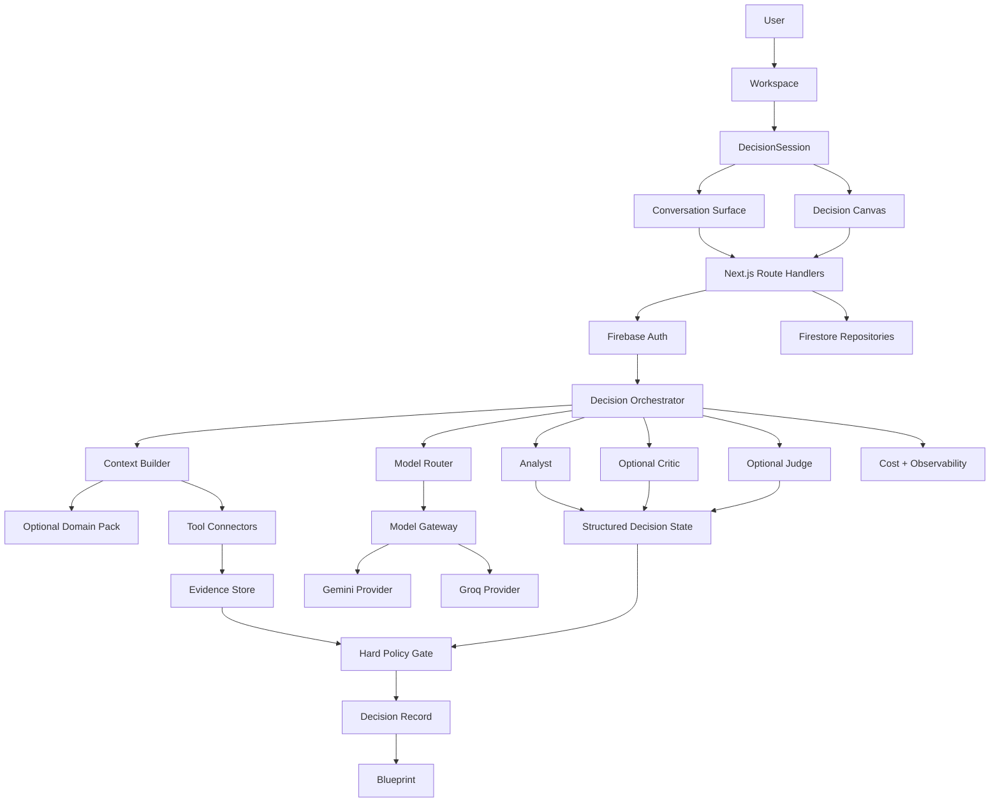
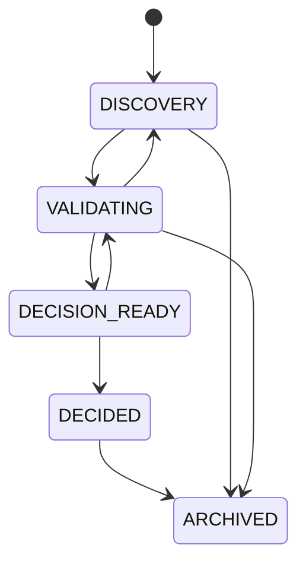
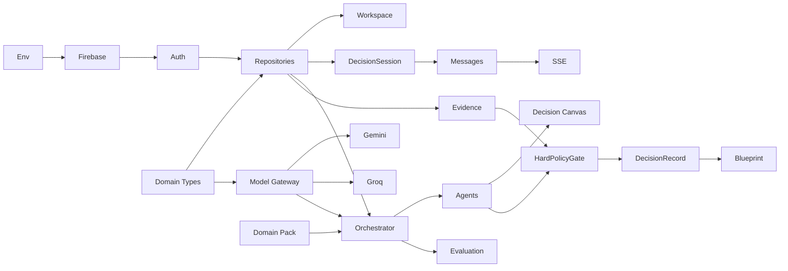

# Layer A — AI Decision Lab
## Coding-Ready Product + Architecture + Engineering Specification

> **Version:** v5  
> **Date:** 2026-09-07  
> **Status:** APPROVED SPECIFICATION FOR MVP IMPLEMENTATION  
> **Baseline stack:** Next.js App Router + TypeScript strict + Firebase Auth + Firestore + Gemini + Groq + GitHub + Vercel  
> **Primary language:** Vietnamese UI, English code identifiers  
> **Primary purpose:** Domain-agnostic AI Decision Lab with chat as the primary interaction surface  
> **Reference vertical:** ChallengeReady Domain Pack  
> **Source baseline:** `26-09-07-08-52-layer-a-multi-ai-chat-engine.markdown`

---

# 1. Executive Summary

Layer A is upgraded from a **Multi-AI Chat Engine** into a **domain-agnostic AI Decision Lab**.

The core thesis is:

> **Chat is the interaction surface. Decision is the product.**

The system must help a user move from an unclear idea to a structured and auditable decision:

```text
IDEA
→ PROBLEM
→ ASSUMPTIONS
→ OPTIONS
→ EVIDENCE
→ CRITIQUE
→ EXPERIMENT
→ DECISION
→ BLUEPRINT
→ IMPLEMENTATION
```

The application is not a generic room where several AI models freely debate. It is a bounded orchestration system where AI roles have narrow responsibilities, tools provide verifiable evidence, important claims preserve provenance, and every additional model call must justify its cost.

The MVP intentionally keeps the original technical direction:

- Next.js App Router
- TypeScript strict
- Firebase Auth
- Firestore
- Gemini
- Groq
- GitHub
- Vercel
- Zod
- server-side API keys
- bounded multi-agent orchestration
- cost and latency observability

The main architectural evolution is:

```text
CURRENT
User → Thread → Messages → Orchestrator

TARGET
User → Workspace → DecisionSession
                 ├ Conversation
                 ├ Structured Decision State
                 ├ Evidence
                 ├ Agent Runs
                 ├ Decision Record
                 └ Blueprint
```

No full rewrite is required.

---

# 2. Product Definition

## 2.1 One-sentence definition

**Layer A is a domain-agnostic AI Decision Lab that helps humans use bounded multi-model AI to frame problems, generate alternatives, challenge assumptions, verify claims, compare options, record decisions, and produce implementation-ready blueprints.**

## 2.2 What it is

Layer A is:

- a project decision workspace;
- a structured AI discussion room;
- a multi-provider orchestration engine;
- a decision memory system;
- an evidence and experiment framework;
- a blueprint generator;
- a reusable foundation for future verticals.

## 2.3 What it is not

Layer A is not:

- a generic ChatGPT clone;
- an unrestricted AI debate room;
- an autonomous software factory;
- a trading signal service;
- a full RAG platform;
- a knowledge graph;
- a workflow OS for every possible business problem;
- a replacement for human approval on consequential decisions.

---

# 3. Goals

The MVP must prove that the application can:

1. create a reusable Workspace for any project;
2. create Decision Sessions inside a Workspace;
3. support normal streaming chat inside each Decision Session;
4. maintain structured decision state outside the chat transcript;
5. call Gemini and Groq through one Model Gateway;
6. run conditional Analyst → Critic → Judge flows;
7. preserve evidence provenance;
8. create an immutable Decision Record;
9. generate an APPROVED Blueprint for downstream coding agents;
10. log model, token, latency, cost, prompt version, and failures;
11. prove that the same core can work without ChallengeReady;
12. attach ChallengeReady only as a reference Domain Pack.

## Product success condition

The MVP is successful if a user can start with:

> “I want to build a web app to train new FTMO challenge traders.”

and finish with:

- a clearly framed problem;
- explicit assumptions;
- multiple candidate directions;
- evidence and unresolved unknowns;
- an auditable final decision;
- a coding-ready blueprint.

---

# 4. Non-goals

Explicitly out of MVP scope:

- OpenAI provider
- Anthropic provider
- more than 3 core agent roles
- unrestricted multi-agent debate
- LangGraph
- Temporal
- Redis
- PostgreSQL migration
- vector database
- full RAG platform
- autonomous browser automation
- autonomous coding
- team collaboration
- comments and mentions
- billing
- public marketplace
- public template marketplace
- full experiment execution platform
- knowledge graph
- real-time collaborative editor
- mobile native app
- full ChallengeReady product
- broker integration
- trading execution
- full mentor dashboard

---

# 5. Architecture Principles

## P1 — Decision-first
`DecisionSession` is the primary business object. `Message` is a child object.

## P2 — Evidence over opinion
AI output is not automatically evidence. Every evidence item must preserve provenance.

## P3 — Deterministic before probabilistic
If a calculation or rule can be executed deterministically, code must do it.

## P4 — Multi-Agent must earn its cost
Do not call Critic or Judge when they are unlikely to create information gain.

## P5 — Domain logic stays outside core
ChallengeReady, Code Review, Real Estate, Legal, SEO and other domains must not be hard-coded in the core orchestrator.

## P6 — Tools are not domains
GitHub, Web, Files, Calculator and Database are Tool Connectors.

## P7 — Providers are replaceable
Business/domain code must not import Gemini or Groq SDKs directly.

## P8 — Decisions are auditable
Important decisions must have a `DecisionRecord`.

## P9 — Blueprint before implementation
Coding agents consume canonical Blueprint output, not raw chat history.

## P10 — Avoid platform overengineering
MVP must be the minimum useful Decision Lab, not a maximum imaginable AI operating system.

---

# 6. Canonical Terminology

| Canonical term | Meaning |
|---|---|
| Workspace | Project-level container |
| DecisionSession | One structured decision/problem lifecycle |
| Message | Conversation message inside a DecisionSession |
| DecisionState | Structured assumptions/options/criteria/unknowns |
| EvidenceItem | Provenance-aware supporting or contradicting evidence |
| AgentRun | One AI role execution |
| DecisionRecord | Immutable approved decision artifact |
| Blueprint | Implementation handoff artifact |
| ModelProvider | Gemini, Groq, future providers |
| AgentRole | Analyst, Critic, Judge |
| DomainPack | Optional domain-specific behavior |
| ToolConnector | External tool/data integration |
| DecisionOrchestrator | Workflow coordinator |
| ModelGateway | Provider abstraction |
| HardPolicyGate | Deterministic validation gate |

Deprecated terminology:

- `Thread` → `DecisionSession`
- `Generic Assist Adapter` → `Generic Decision Workflow`
- `Domain Adapter` → `DomainPack`
- `Coach` in core Layer A → `Analyst`

---

# 7. Target Architecture



---

# 8. Core Domain Model

MVP entities:

```text
User
Workspace
DecisionSession
Message
EvidenceItem
AgentRun
DecisionRecord
Blueprint
```

The following remain nested structured fields inside `DecisionSession` in MVP:

```text
Constraint
Assumption
Unknown
Option
Criterion
```

Do not create dedicated collections for them until a real query requirement exists.

---

# 9. TypeScript Domain Contracts

## 9.1 Shared primitive types

```ts
export type ISODateTime = string;
export type EntityStatus = "ACTIVE" | "ARCHIVED";

export type DecisionSessionStatus =
  | "DISCOVERY"
  | "VALIDATING"
  | "DECISION_READY"
  | "DECIDED"
  | "ARCHIVED";

export type EvidenceType =
  | "SOURCE_CODE"
  | "OFFICIAL_DOCUMENTATION"
  | "WEB_SOURCE"
  | "USER_FACT"
  | "USER_CLAIM"
  | "CALCULATION"
  | "EXPERIMENT"
  | "AI_INFERENCE";

export type EvidenceReliability = "HIGH" | "MEDIUM" | "LOW";
export type OptionStatus = "PROPOSED" | "SHORTLISTED" | "REJECTED" | "SELECTED";
export type BlueprintStatus = "DRAFT" | "REVIEW" | "APPROVED" | "SUPERSEDED";
export type AgentRole = "ANALYST" | "CRITIC" | "JUDGE";
export type RouteMode = "QUICK" | "STANDARD" | "DEEP";
export type RunStatus = "QUEUED" | "RUNNING" | "COMPLETED" | "PARTIAL" | "FAILED" | "CANCELLED";
```

## 9.2 Workspace

```ts
export interface Workspace {
  id: string;
  ownerId: string;
  name: string;
  description?: string;
  status: EntityStatus;
  defaultDomainPackId?: string;
  createdAt: ISODateTime;
  updatedAt: ISODateTime;
  archivedAt?: ISODateTime;
}
```

## 9.3 DecisionState primitives

```ts
export interface Constraint {
  id: string;
  statement: string;
  source: "USER" | "SYSTEM" | "DOMAIN_PACK" | "AI";
  confirmedByUser: boolean;
}

export interface Assumption {
  id: string;
  statement: string;
  status: "UNVERIFIED" | "SUPPORTED" | "CONTRADICTED" | "ACCEPTED_FOR_NOW";
  importance: "LOW" | "MEDIUM" | "HIGH";
  evidenceIds: string[];
}

export interface Unknown {
  id: string;
  question: string;
  importance: "LOW" | "MEDIUM" | "HIGH";
  resolution:
    | "OPEN"
    | "VERIFY_NOW"
    | "EXPERIMENT_REQUIRED"
    | "HUMAN_DECISION_REQUIRED"
    | "RESOLVED";
  evidenceIds: string[];
}

export interface Criterion {
  id: string;
  name: string;
  description?: string;
  weight: number;
  proposedBy: "USER" | "AI" | "DOMAIN_PACK";
  confirmedByUser: boolean;
}

export interface Option {
  id: string;
  title: string;
  description: string;
  pros: string[];
  cons: string[];
  risks: string[];
  estimatedCost?: {
    value?: number;
    currency?: string;
    note?: string;
  };
  implementationComplexity?: "LOW" | "MEDIUM" | "HIGH";
  evidenceIds: string[];
  criterionScores?: Record<string, number>;
  status: OptionStatus;
}
```

Validation rule:

```text
sum(Criterion.weight) must equal 1.0 ± 0.001 before formal scoring
```

## 9.4 DecisionSession

```ts
export interface DecisionSession {
  id: string;
  workspaceId: string;
  ownerId: string;
  title: string;
  problem: string;
  objective?: string;
  constraints: Constraint[];
  assumptions: Assumption[];
  unknowns: Unknown[];
  options: Option[];
  criteria: Criterion[];
  domainPackId?: string;
  status: DecisionSessionStatus;
  activeDecisionRecordId?: string;
  activeBlueprintId?: string;
  latestSummary?: string;
  createdAt: ISODateTime;
  updatedAt: ISODateTime;
  archivedAt?: ISODateTime;
}
```

## 9.5 Message

```ts
export interface Message {
  id: string;
  workspaceId: string;
  sessionId: string;
  ownerId: string;
  role: "USER" | "ASSISTANT" | "SYSTEM" | "TOOL";
  content: string;
  runId?: string;
  agentRole?: AgentRole;
  provider?: string;
  model?: string;
  createdAt: ISODateTime;
}
```

## 9.6 EvidenceItem

```ts
export interface EvidenceItem {
  id: string;
  workspaceId: string;
  sessionId: string;
  ownerId: string;
  type: EvidenceType;
  claim: string;
  source?: string;
  reliability: EvidenceReliability;
  createdBy: "USER" | "AI" | "TOOL" | "SYSTEM";
  supportsOptionIds: string[];
  contradictsOptionIds: string[];
  verifiedAt?: ISODateTime;
  metadata?: Record<string, unknown>;
  createdAt: ISODateTime;
}
```

Invariant:

```text
AI_INFERENCE != FACT
```

## 9.7 AgentRun

```ts
export interface AgentRun {
  id: string;
  workspaceId: string;
  sessionId: string;
  ownerId: string;
  role: AgentRole;
  routeMode: RouteMode;
  provider: string;
  model: string;
  promptVersion: string;
  schemaVersion: string;
  inputTokens?: number;
  outputTokens?: number;
  cachedTokens?: number;
  latencyMs?: number;
  costUsd?: number;
  status: RunStatus;
  errorCode?: string;
  errorMessage?: string;
  startedAt: ISODateTime;
  finishedAt?: ISODateTime;
}
```

## 9.8 DecisionRecord

```ts
export interface DecisionRecord {
  id: string;
  workspaceId: string;
  sessionId: string;
  ownerId: string;
  problem: string;
  selectedOptionId?: string;
  decision:
    | "ACCEPT"
    | "ACCEPT_WITH_CHANGES"
    | "EXPERIMENT_FIRST"
    | "REJECT"
    | "INSUFFICIENT_EVIDENCE";
  rationale: string[];
  selectedEvidenceIds: string[];
  rejectedOptions: Array<{
    optionId: string;
    reasons: string[];
  }>;
  acceptedAssumptionIds: string[];
  unresolvedUnknownIds: string[];
  tradeoffs: string[];
  confidence: {
    type: "HEURISTIC";
    label: "LOW" | "MEDIUM" | "HIGH";
    score: number;
    factors: {
      evidenceCoverage: number;
      sourceReliability: number;
      unresolvedUnknownPenalty: number;
      assumptionPenalty: number;
      agentAgreement: number;
      experimentStrength: number;
    };
  };
  reviewTriggers: string[];
  supersedesDecisionRecordId?: string;
  approvedBy: string;
  approvedAt: ISODateTime;
  createdAt: ISODateTime;
}
```

Approved `DecisionRecord` is immutable.

## 9.9 Blueprint

```ts
export interface Blueprint {
  id: string;
  workspaceId: string;
  sessionId: string;
  ownerId: string;
  sourceDecisionRecordId: string;
  status: BlueprintStatus;
  title: string;
  projectGoal: string;
  problem: string;
  targetUsers: string[];
  scope: string[];
  nonGoals: string[];
  modules: BlueprintModule[];
  architecture: {
    summary: string;
    mermaid?: string;
  };
  dataModel: string[];
  apiContracts: BlueprintApiContract[];
  aiWorkflow: string[];
  securityRequirements: string[];
  observabilityRequirements: string[];
  testRequirements: string[];
  deploymentRequirements: string[];
  acceptanceCriteria: string[];
  openRisks: string[];
  decisionReferences: string[];
  createdAt: ISODateTime;
  approvedAt?: ISODateTime;
  supersededAt?: ISODateTime;
}

export interface BlueprintModule {
  name: string;
  jobToBeDone: string;
  inputs: string[];
  outputs: string[];
  dependencies: string[];
  acceptanceCriteria: string[];
}

export interface BlueprintApiContract {
  method: string;
  path: string;
  purpose: string;
}
```

## 9.10 AI contracts

```ts
export interface AiBudget {
  maxCalls: number;
  maxInputTokens: number;
  maxOutputTokens: number;
  maxCostUsd: number;
  maxRounds: number;
}

export interface ModelCapabilities {
  structuredOutput: boolean;
  tools: boolean;
  streaming: boolean;
  vision: boolean;
  maxContextTokens: number;
}

export interface NormalizedModelRequest {
  role: AgentRole;
  routeMode: RouteMode;
  systemInstructions: string;
  messages: Array<{
    role: "system" | "user" | "assistant" | "tool";
    content: string;
  }>;
  outputSchemaName?: string;
  maxOutputTokens: number;
  temperature?: number;
  metadata: {
    requestId: string;
    workspaceId: string;
    sessionId: string;
    promptVersion: string;
  };
}

export interface ModelResult<T = unknown> {
  provider: string;
  model: string;
  content: string;
  structured?: T;
  usage: {
    inputTokens?: number;
    outputTokens?: number;
    cachedTokens?: number;
  };
  latencyMs: number;
  estimatedCostUsd?: number;
}
```

## 9.11 DomainPack

```ts
export interface DomainPack {
  id: string;
  version: string;
  displayName: string;

  getContext(args: {
    userId: string;
    workspaceId: string;
    sessionId: string;
  }): Promise<Record<string, unknown>>;

  runDeterministicChecks(input: unknown): Promise<Array<{
    code: string;
    passed: boolean;
    message: string;
    metadata?: Record<string, unknown>;
  }>>;

  getRoleInstructions(role: AgentRole): string;
  getOutputSchemaName(role: AgentRole): string;

  validateDecision(decision: DecisionRecord): Promise<{
    valid: boolean;
    errors: string[];
  }>;

  getDecisionCriteria?(): Criterion[];
  getToolConnectorIds?(): string[];
  getEvaluationSuiteId?(): string;
}
```

## 9.12 ToolConnector

```ts
export interface ToolConnector {
  id: string;
  name: string;
  capabilities: string[];

  execute<TInput = unknown, TOutput = unknown>(
    action: string,
    input: TInput
  ): Promise<{
    success: boolean;
    output?: TOutput;
    error?: string;
    evidence?: EvidenceItem[];
  }>;
}
```

---

# 10. Decision Session State Machine



## DISCOVERY → VALIDATING

Required:

- problem is non-empty;
- objective or explicit decision question exists;
- at least one option exists or user asks to generate options.

## VALIDATING → DISCOVERY

Allowed when:

- new evidence materially changes problem framing;
- user redefines objective;
- major assumption becomes invalid.

## VALIDATING → DECISION_READY

Required:

- at least one option exists;
- important assumptions are identified;
- high-priority unknowns are resolved, accepted, or marked experiment-required;
- no mandatory domain validation error exists.

## DECISION_READY → VALIDATING

Allowed when:

- user requests more research;
- contradictory evidence appears;
- Judge returns `INSUFFICIENT_EVIDENCE`.

## DECISION_READY → DECIDED

Required:

- Judge output passes HardPolicyGate;
- user explicitly approves;
- DecisionRecord is created.

---

# 11. Product Modules

| Module | Job-to-be-done | AI responsibility | Deterministic responsibility | MVP |
|---|---|---|---|---:|
| Workspace | Organize project decisions | None | ownership/state | ✅ |
| Decision Session | Turn one problem into decision | framing/options/analysis | lifecycle | ✅ |
| Conversation Surface | Natural collaboration | responses | persistence/stream state | ✅ |
| Decision Canvas | Keep structured decision visible | summaries | render state | ✅ |
| Model Gateway | Provider-neutral AI access | model execution | routing contract | ✅ |
| Decision Orchestrator | Coordinate reasoning | role execution | budget/stop/state | ✅ |
| Evidence & Tools | Separate facts from opinion | interpretation | provenance | ✅ basic |
| Decision & Blueprint | Preserve result and handoff | synthesis | immutability/gates | ✅ |

---

# 12. UI / UX Specification

## Desktop

```text
┌─────────────────────────────────────────────────────────────┐
│ Top Bar: Workspace / Session / Mode / Cost                 │
├──────────────┬─────────────────────────┬────────────────────┤
│ Sessions     │ Conversation            │ Decision Canvas    │
│              │                         │                    │
│ Session A    │ User                    │ Overview           │
│ Session B    │ Analyst                 │ Options            │
│ Session C    │ Critic                  │ Evidence           │
│              │ Judge                   │ Decision           │
│              │                         │ Blueprint          │
├──────────────┴─────────────────────────┴────────────────────┤
│ Composer                                      Send / Stop   │
└─────────────────────────────────────────────────────────────┘
```

## Tablet

- collapsible Workspace/Session sidebar;
- conversation remains primary;
- Decision Canvas opens as side drawer.

## Mobile

- conversation full-screen;
- session switcher in top bar;
- Decision Canvas opens as full-screen sheet;
- composer fixed bottom;
- no three-column squeeze.

## Required UI states

```text
empty
loading
streaming
completed
partial failure
provider failure
validation failure
budget exhausted
no evidence
decision ready
decision approved
blueprint draft
blueprint approved
```

## Partial failure

If Critic times out:

- preserve Analyst output;
- mark critique incomplete;
- show retry action;
- do not falsely mark run complete;
- retain partial AgentRun.

---

# 13. Core UI Components

```text
WorkspaceSidebar
WorkspaceSwitcher
SessionList
SessionHeader
ChatPanel
MessageList
MessageBubble
Composer
AgentStatus
RunStatusIndicator
DecisionCanvas
OverviewPanel
OptionsPanel
EvidencePanel
DecisionPanel
BlueprintPanel
ModeSelector
CostIndicator
ErrorBanner
RetryAction
```

No UI component may import provider SDK directly.

---

# 14. AI Role Architecture

## Analyst
Responsibilities:

- problem framing;
- assumption extraction;
- option generation;
- architecture/product analysis.

Profiles:

```text
Problem Framer
Product Analyst
Architect
Idea Generator
```

A profile is prompt configuration, not a new agent type.

## Critic
Responsibilities:

- find unsupported assumptions;
- challenge selected option;
- identify hidden costs;
- find missing evidence;
- identify contradictions.

Modes:

```text
Risk
Devil's Advocate
Cost
User Advocate
Architecture
```

## Judge
Responsibilities:

- synthesize;
- compare options;
- identify unresolved unknowns;
- decide whether more evidence is required;
- create recommendation;
- draft DecisionRecord;
- draft Blueprint after approval.

## Evidence Checker
Not a permanent fourth agent in MVP. Implement as Analyst/Judge + Tool Connectors + provenance rules.

---

# 15. Multi-AI Decision Protocol

| Stage | Name | Requirement |
|---|---|---|
| 0 | Normalize | Mandatory |
| 1 | Extract assumptions | Standard/Deep mandatory |
| 2 | Generate options | Conditional |
| 3 | Independent analysis | Deep mandatory |
| 4 | Deduplicate | Conditional |
| 5 | Critique | Deep default |
| 6 | Verify evidence | Conditional |
| 7 | Experiment | Conditional |
| 8 | Score | Conditional |
| 9 | Judge | Formal decision mandatory |
| 10 | Human approval | Formal decision mandatory |
| 11 | Decision Record | Approved decision mandatory |
| 12 | Blueprint | Implementation handoff only |

---

# 16. Routing Policy

## QUICK
Use for simple, low-consequence clarification.

Default:

```text
Groq only
```

## STANDARD
Use for structured analysis with moderate complexity.

Default:

```text
Gemini Analyst
```

## DEEP
Use for architecture, commercial, scope, high disagreement or weak evidence.

Default:

```text
Gemini Analyst
→ Groq Critic
→ Gemini Judge
```

This mapping is configuration, not business logic.

---

# 17. Information-Gain Routing

Before another AI call, ask:

> Does this call have a reasonable chance to change the decision or materially reduce uncertainty?

Skip Critic when:

- evidence coverage high;
- decision importance low;
- Analyst internally consistent;
- historical Critic lift below threshold.

Escalate when:

- important decision;
- low evidence coverage;
- high uncertainty;
- conflicting evidence;
- user requests independent challenge;
- prior result is fragile under assumptions.

---

# 18. Stop Conditions

```text
ENOUGH_EVIDENCE
LOW_DISAGREEMENT
NO_NEW_INFORMATION
BUDGET_EXHAUSTED
EXPERIMENT_REQUIRED
HUMAN_DECISION_REQUIRED
MAX_ROUNDS_REACHED
```

MVP rules:

- maximum one revision round;
- no recursive agent loops;
- no agent calls itself;
- no Critic → Judge → Critic loop;
- budget exhaustion stops safely;
- experiment-required stops debate and creates next action.

---

# 19. Confidence Model

Confidence is heuristic, not statistical probability.

UI label:

```text
HEURISTIC CONFIDENCE
```

Factors:

```text
evidenceCoverage
sourceReliability
unresolvedUnknowns
assumptionCount
agentAgreement
experimentStrength
```

Suggested formula:

```text
base =
  0.30 * evidenceCoverage
+ 0.20 * sourceReliability
+ 0.15 * agentAgreement
+ 0.20 * experimentStrength
+ 0.15 * knownFactsCoverage

penalty =
  0.15 * unresolvedUnknownPenalty
+ 0.10 * unsupportedAssumptionPenalty

score = clamp((base - penalty) * 100, 0, 100)
```

Do not display fake precision such as `94.37%`.

---

# 20. Evidence Architecture

Evidence categories:

```text
SOURCE_CODE
OFFICIAL_DOCUMENTATION
WEB_SOURCE
USER_FACT
USER_CLAIM
CALCULATION
EXPERIMENT
AI_INFERENCE
```

Suggested default reliability:

| Type | Default |
|---|---|
| SOURCE_CODE | HIGH |
| OFFICIAL_DOCUMENTATION | HIGH |
| CALCULATION | HIGH |
| EXPERIMENT | HIGH/MEDIUM |
| USER_FACT | MEDIUM |
| WEB_SOURCE | MEDIUM |
| USER_CLAIM | LOW/MEDIUM |
| AI_INFERENCE | LOW |

Rules:

1. AI opinion must not silently become fact.
2. Formal DecisionRecord references evidence IDs.
3. Contradictory evidence remains visible.
4. Deleting a Message does not delete approved DecisionRecord.
5. Approved DecisionRecord preserves source evidence references.

---

# 21. Experiment Taxonomy

```text
COMPARISON
CALCULATION
SIMULATION
BENCHMARK
CONTROLLED_EXPERIMENT
AB_TEST
```

Examples:

```text
Firebase vs PostgreSQL → COMPARISON
10,000-user cost → SIMULATION
Gemini vs Groq same dataset → BENCHMARK
Gemini only vs Gemini + Critic → CONTROLLED_EXPERIMENT
Onboarding A vs B on live traffic → AB_TEST
```

Do not call every comparison an A/B test.

---

# 22. Experiment Model

```ts
export type ExperimentType =
  | "COMPARISON"
  | "CALCULATION"
  | "SIMULATION"
  | "BENCHMARK"
  | "CONTROLLED_EXPERIMENT"
  | "AB_TEST";

export interface ExperimentDefinition {
  id: string;
  workspaceId: string;
  sessionId: string;
  hypothesis: string;
  type: ExperimentType;
  variants: Array<{
    id: string;
    name: string;
    config: Record<string, unknown>;
  }>;
  metrics: Array<{
    name: string;
    direction: "HIGHER_BETTER" | "LOWER_BETTER";
  }>;
  datasetId?: string;
  sampleSize?: number;
  runConfig: Record<string, unknown>;
  budget?: AiBudget;
  status: "DRAFT" | "READY" | "RUNNING" | "COMPLETED" | "CANCELLED";
  results?: Record<string, unknown>;
  winnerVariantId?: string;
  limitations: string[];
}
```

MVP: schema + persistence + benchmark metadata. Full experiment runner is later.

---

# 23. Decision Matrix

Formal scoring is optional unless session is comparative.

Rules:

- AI may propose criteria;
- user confirms important weights;
- weights sum to 1.0;
- scores include rationale/evidence.

Sensitivity analysis is Phase 2, not MVP.

---

# 24. Decision Record Rules

DecisionRecord:

- immutable after approval;
- superseded, never edited in place;
- references session;
- references selected evidence;
- preserves rejected alternatives;
- includes review triggers;
- labels confidence as heuristic.

Example review trigger:

```text
Re-evaluate Firebase if:
- cross-project analytics becomes complex;
- experiment dataset becomes relationally dense;
- billing/reporting requires relational joins.
```

---

# 25. Blueprint Rules

Blueprint is the coding handoff artifact.

Statuses:

```text
DRAFT
REVIEW
APPROVED
SUPERSEDED
```

Coding agents should consume only APPROVED Blueprint unless user explicitly requests prototype work.

---

# 26. Domain Pack Architecture

## Core rule

Layer A must run without any Domain Pack.

Default:

```text
Generic Decision Workflow
```

ChallengeReady is optional:

```text
ChallengeReadyDomainPack
```

Future examples:

```text
CodeReviewDomainPack
RealEstateDomainPack
LegalReviewDomainPack
SEOAuditDomainPack
```

## DomainPack responsibilities

A Domain Pack may provide:

- domain context;
- deterministic checks;
- role instructions;
- output schema names;
- decision validation;
- default criteria;
- tool recommendations;
- evaluation suite reference.

A Domain Pack must not:

- import provider SDK directly;
- own authentication;
- bypass HardPolicyGate;
- write directly to Firestore outside repository contracts;
- override system security rules.

---

# 27. Tool Connector Architecture

Tool Connectors are independent from Domain Packs.

Future connectors:

```text
GitHub
Files
WebSearch
Calculator
Database
Browser
```

Correct:

```text
CodeReviewDomainPack
+
GitHubToolConnector
```

Incorrect:

```text
GitHubDomainPack
```

---

# 28. Model Gateway

```ts
export interface ModelProvider {
  id: string;
  capabilities(): ModelCapabilities;

  generate<T = unknown>(
    request: NormalizedModelRequest
  ): Promise<ModelResult<T>>;

  stream?(
    request: NormalizedModelRequest
  ): AsyncIterable<ModelStreamEvent>;

  health(): Promise<{
    ok: boolean;
    latencyMs?: number;
  }>;
}
```

MVP implementations:

```text
GeminiProvider
GroqProvider
```

Business code depends on `ModelProvider`, never provider SDK classes.

---

# 29. Model Capability Registry

```ts
export interface ModelRegistryEntry {
  provider: string;
  model: string;
  capabilities: ModelCapabilities;
  enabled: boolean;
  routingTags: string[];
  pricing?: {
    inputPerMillion?: number;
    outputPerMillion?: number;
  };
}
```

Pricing is configuration, not domain logic.

---

# 30. Provider Failure Policy

## QUICK

If Groq fails:

- fallback to Gemini if budget allows;
- log fallback.

## STANDARD

If Gemini fails:

- fallback to Groq if route requirements remain satisfiable.

## DEEP

If Critic fails:

- keep Analyst result;
- mark run PARTIAL;
- allow retry;
- Judge may run only if policy allows incomplete critique.

If Judge fails:

- do not create final DecisionRecord;
- keep session DECISION_READY or VALIDATING;
- show partial result.

---

# 31. AI Budget Governance

Suggested defaults:

```ts
export const DEFAULT_BUDGETS: Record<RouteMode, AiBudget> = {
  QUICK: {
    maxCalls: 1,
    maxInputTokens: 12000,
    maxOutputTokens: 2000,
    maxCostUsd: 0.02,
    maxRounds: 1
  },
  STANDARD: {
    maxCalls: 2,
    maxInputTokens: 24000,
    maxOutputTokens: 5000,
    maxCostUsd: 0.08,
    maxRounds: 1
  },
  DEEP: {
    maxCalls: 4,
    maxInputTokens: 50000,
    maxOutputTokens: 10000,
    maxCostUsd: 0.25,
    maxRounds: 1
  }
};
```

These are product defaults, not provider guarantees.

---

# 32. Context Management

Do not send full chat history forever.

Context Builder should include:

1. latest structured DecisionState;
2. recent relevant messages;
3. selected evidence;
4. optional session summary;
5. Domain Pack context;
6. explicit current user request.

Never truncate:

- system security instructions;
- HardPolicyGate rules;
- required output schema.

Suggested starting strategy:

```text
latest structured state
+
latest 12 relevant messages
+
selected evidence
+
latest summary
```

---

# 33. Session Summary

When history grows:

- create structured summary;
- persist as `latestSummary`;
- log prompt version;
- preserve original messages;
- never use summary as replacement for DecisionRecord.

---

# 34. Prompt Registry

Prompts must not be embedded as giant route-handler strings.

```text
src/ai/prompts/
├ analyst/
│  ├ base.v1.ts
│  ├ architect.v1.ts
│  └ product-analyst.v1.ts
├ critic/
│  ├ base.v1.ts
│  ├ risk.v1.ts
│  └ architecture.v1.ts
└ judge/
   └ base.v1.ts
```

```ts
export interface PromptDefinition {
  id: string;
  version: string;
  role: AgentRole;
  schemaVersion: string;
  template: string;
}
```

AgentRun must persist `promptVersion`.

---

# 35. Hard Policy Gate

HardPolicyGate is code, not an AI role.

It validates:

- Zod schema;
- session state;
- required fields;
- AI budget;
- Domain Pack deterministic checks;
- evidence requirement;
- unsafe Tool Connector action;
- impossible state transition;
- duplicate immutable artifact creation.

```ts
export interface GateResult {
  passed: boolean;
  errors: Array<{
    code: string;
    message: string;
  }>;
}
```

---

# 36. Firestore Data Model

## Collections

```text
users/{uid}

workspaces/{workspaceId}

workspaces/{workspaceId}/sessions/{sessionId}

workspaces/{workspaceId}/sessions/{sessionId}/messages/{messageId}

workspaces/{workspaceId}/sessions/{sessionId}/evidence/{evidenceId}

workspaces/{workspaceId}/sessions/{sessionId}/agentRuns/{runId}

workspaces/{workspaceId}/sessions/{sessionId}/experiments/{experimentId}

decisionRecords/{decisionRecordId}

blueprints/{blueprintId}
```

## Ownership

Persist enough ownership data to authorize:

```text
ownerId
workspaceId
sessionId where applicable
```

## Required query patterns

- list active Workspaces by owner;
- list sessions by workspace ordered by updatedAt;
- list messages by session ordered by createdAt;
- list evidence by session;
- list AgentRuns by session ordered by startedAt;
- fetch current DecisionRecord;
- fetch current Blueprint.

## Likely composite indexes

```text
workspaces:
ownerId ASC, status ASC, updatedAt DESC

sessions:
ownerId ASC, status ASC, updatedAt DESC

agentRuns:
ownerId ASC, startedAt DESC
```

Exact indexes should be confirmed from implemented queries.

---

# 37. Repository Abstraction

No direct Firestore access from UI or domain services.

Interfaces:

```text
WorkspaceRepository
DecisionSessionRepository
MessageRepository
EvidenceRepository
AgentRunRepository
DecisionRecordRepository
BlueprintRepository
ExperimentRepository
```

Example:

```ts
export interface WorkspaceRepository {
  create(input: Omit<Workspace, "id">): Promise<Workspace>;
  getById(id: string, ownerId: string): Promise<Workspace | null>;
  listByOwner(ownerId: string): Promise<Workspace[]>;
  update(
    id: string,
    ownerId: string,
    patch: Partial<Pick<Workspace, "name" | "description" | "status">>
  ): Promise<Workspace>;
}
```

Firestore implementations:

```text
FirestoreWorkspaceRepository
FirestoreDecisionSessionRepository
FirestoreMessageRepository
FirestoreEvidenceRepository
FirestoreAgentRunRepository
FirestoreDecisionRecordRepository
FirestoreBlueprintRepository
FirestoreExperimentRepository
```

This is the migration seam to PostgreSQL later.

---

# 38. Authentication

MVP choice:

## Google Sign-In only

Reason:

- lower scope;
- suitable for private/internal MVP;
- smaller password security surface.

Requirements:

- Firebase Auth;
- server verifies ID token;
- authenticated UID determines owner;
- client-provided `ownerId` is never trusted.

Email/password can be added later if product demand requires it.

---

# 39. Authorization

Default:

```text
deny by default
allow owner only
```

User may access Workspace only when ownership is verified.

Nested Session access verifies parent ownership.

Approved DecisionRecord must be immutable to arbitrary client writes.

Preferred implementation:

- normal user CRUD through authenticated Route Handlers;
- client reads permitted records;
- sensitive artifact writes server-side;
- Firestore rules deny cross-user access.

---

# 40. API Surface

Canonical MVP endpoints:

```text
GET    /api/workspaces
POST   /api/workspaces

GET    /api/workspaces/:workspaceId
PATCH  /api/workspaces/:workspaceId

GET    /api/workspaces/:workspaceId/sessions
POST   /api/workspaces/:workspaceId/sessions

GET    /api/sessions/:sessionId
PATCH  /api/sessions/:sessionId

GET    /api/sessions/:sessionId/messages
POST   /api/sessions/:sessionId/messages

POST   /api/sessions/:sessionId/run

GET    /api/sessions/:sessionId/evidence
POST   /api/sessions/:sessionId/evidence

POST   /api/sessions/:sessionId/decision
GET    /api/sessions/:sessionId/decision

POST   /api/sessions/:sessionId/blueprint
GET    /api/sessions/:sessionId/blueprint

GET    /api/sessions/:sessionId/runs
```

Avoid one endpoint per AI role unless a real need appears.

---

# 41. API Contracts

## POST /api/workspaces

**Purpose:** Create Workspace.  
**Auth:** Required.

```ts
const CreateWorkspaceSchema = z.object({
  name: z.string().min(1).max(120),
  description: z.string().max(2000).optional(),
  defaultDomainPackId: z.string().optional()
});
```

Errors:

```text
UNAUTHORIZED
VALIDATION_ERROR
INTERNAL_ERROR
```

## POST /api/workspaces/:workspaceId/sessions

**Purpose:** Create DecisionSession.

```ts
const CreateSessionSchema = z.object({
  title: z.string().min(1).max(160),
  problem: z.string().min(1).max(10000),
  objective: z.string().max(5000).optional(),
  domainPackId: z.string().optional()
});
```

Side effects:

- create status `DISCOVERY`;
- persist timestamps;
- no automatic expensive AI run.

## POST /api/sessions/:sessionId/messages

```ts
const CreateMessageSchema = z.object({
  content: z.string().min(1).max(20000)
});
```

Side effects:

- persist user message;
- AI execution is triggered through `/run`.

## POST /api/sessions/:sessionId/run

```ts
const RunSessionSchema = z.object({
  routeMode: z.enum(["QUICK", "STANDARD", "DEEP"]),
  intent: z.enum([
    "DISCUSS",
    "FRAME_PROBLEM",
    "GENERATE_OPTIONS",
    "CRITIQUE",
    "VERIFY",
    "PREPARE_DECISION"
  ]),
  messageId: z.string().optional()
});
```

Response: SSE stream.

## POST /api/sessions/:sessionId/decision

Preconditions:

- session status `DECISION_READY`;
- Judge draft exists;
- explicit user approval;
- HardPolicyGate passes.

```ts
const ApproveDecisionSchema = z.object({
  judgeRunId: z.string(),
  approve: z.literal(true)
});
```

## POST /api/sessions/:sessionId/blueprint

Preconditions:

- approved DecisionRecord exists.

```ts
const CreateBlueprintSchema = z.object({
  sourceDecisionRecordId: z.string()
});
```

---

# 42. Streaming Protocol

Use **Server-Sent Events (SSE)** for MVP.

Reasons:

- simple server → client streaming;
- compatible with Vercel Route Handlers;
- no WebSocket complexity.

Event types:

```text
run.started
agent.started
token.delta
agent.completed
tool.started
tool.completed
decision.state.updated
run.partial
run.completed
run.failed
```

Example:

```text
event: agent.started
data: {"runId":"run_123","role":"ANALYST","provider":"gemini"}

event: token.delta
data: {"runId":"run_123","text":"The core problem is..."}

event: decision.state.updated
data: {"sessionId":"sess_1","patch":{"assumptions":[]}}

event: run.completed
data: {"runId":"run_123","status":"COMPLETED"}
```

---

# 43. API Error Model

```ts
export interface ApiError {
  code:
    | "UNAUTHORIZED"
    | "FORBIDDEN"
    | "NOT_FOUND"
    | "VALIDATION_ERROR"
    | "RATE_LIMITED"
    | "PROVIDER_TIMEOUT"
    | "PROVIDER_ERROR"
    | "AI_BUDGET_EXCEEDED"
    | "SCHEMA_INVALID"
    | "SESSION_INVALID_STATE"
    | "IDEMPOTENCY_CONFLICT"
    | "INTERNAL_ERROR";
  message: string;
  retryable: boolean;
  requestId: string;
}
```

Never return provider secrets or raw stack traces.

---

# 44. Retry Policy

## Provider timeout

- maximum 1 retry per provider call;
- retry only retryable network/provider errors;
- no retry for validation errors.

## Invalid structured output

- one repair retry maximum;
- include schema error only;
- if still invalid, mark AgentRun FAILED.

## Backoff

MVP:

```text
first retry after 500–1000ms jitter
```

No distributed retry infrastructure.

---

# 45. Idempotency

Required for:

- DecisionRecord creation;
- Blueprint generation.

Client sends:

```text
Idempotency-Key
```

Server stores mapping:

```text
ownerId + endpoint + idempotencyKey → result artifact id
```

Same key returns same artifact.

---

# 46. Rate Limiting

MVP:

- per-UID limit;
- Firestore-backed for production consistency.

Suggested initial default:

```text
30 AI runs / hour / user
```

CRUD routes may have higher limits.

Do not add Redis in MVP.

---

# 47. Security Architecture

Required controls:

- provider API keys server-only;
- Firebase Admin server-only;
- Firebase Auth required;
- authorization on every Workspace/Session route;
- Zod validation at API boundary;
- Tool Connector allowlist;
- input size limits;
- output schema validation;
- rate limiting;
- prompt injection boundaries;
- PII minimization;
- structured logs;
- secret redaction;
- safe errors;
- no trust in client ownerId;
- CORS limited where applicable.

---

# 48. Prompt Injection Hierarchy

Trust order:

```text
1. SYSTEM SECURITY POLICY
2. CORE ORCHESTRATION POLICY
3. DOMAIN PACK INSTRUCTIONS
4. USER REQUEST
5. TOOL OUTPUT
6. EXTERNAL / UNTRUSTED SOURCE CONTENT
```

Tool and source content are data. They cannot override higher-level instructions.

---

# 49. Tool Permissions

Every connector action is classified as:

```text
READ
WRITE
EXECUTE
```

MVP default:

```text
READ-only connectors
```

No autonomous external writes.

ChallengeReady Reference Pack does not execute trades.

---

# 50. Observability

MVP:

- Vercel logs;
- structured application logs;
- Firestore AgentRun collection;
- requestId;
- sessionId;
- workspaceId.

Every model call logs:

```text
provider
model
role
routeMode
promptVersion
schemaVersion
inputTokens
outputTokens
cachedTokens
latencyMs
costUsd
status
errorCode
```

Never log raw secrets.

Avoid logging full user content by default in production logs.

---

# 51. Evaluation Architecture

Evaluation is core even if UI is deferred.

Baseline comparisons:

```text
A. Single Groq
B. Single Gemini
C. Gemini Analyst + Groq Critic
D. Gemini Analyst + Groq Critic + Gemini Judge
```

Metrics:

```text
quality
correctness
evidence quality
latency
cost
schema failure rate
user preference
stability
```

---

# 52. Evaluation Data Model

```ts
export interface EvaluationCase {
  id: string;
  name: string;
  input: Record<string, unknown>;
  expected?: Record<string, unknown>;
  rubric: string[];
}

export interface EvaluationRun {
  id: string;
  caseId: string;
  configurationId: string;
  startedAt: ISODateTime;
  completedAt?: ISODateTime;
  costUsd?: number;
  latencyMs?: number;
}

export interface EvaluationResult {
  id: string;
  runId: string;
  scores: Record<string, number>;
  notes: string[];
  passed?: boolean;
}
```

No dedicated evaluation UI is required in MVP.

---

# 53. Self-Evaluation Questions

The platform should eventually answer:

- Does Critic create measurable lift?
- Does Judge improve final decisions?
- Is Gemini worth additional cost over Groq?
- Which prompt version produces fewer unsupported claims?
- Which route has best cost/quality ratio?
- Which role has highest schema failure rate?

---

# 54. Testing Strategy

## Unit tests

Must cover:

- Zod schemas;
- state transitions;
- routing;
- budget checks;
- confidence calculation;
- repository contract behavior;
- HardPolicyGate;
- idempotency helper.

## Integration tests

Must cover:

- Firebase repository integration;
- Gemini adapter;
- Groq adapter;
- ModelGateway;
- orchestrator;
- API auth;
- DecisionRecord creation;
- Blueprint generation.

## E2E

Must cover:

1. login;
2. create Workspace;
3. create DecisionSession;
4. send message;
5. QUICK run;
6. DEEP run;
7. view Decision Canvas;
8. move to DECISION_READY;
9. approve DecisionRecord;
10. generate Blueprint.

## Security tests

Must cover:

- user A cannot read user B Workspace;
- unauthenticated AI route blocked;
- direct client DecisionRecord write blocked;
- API keys absent from browser bundle;
- oversized inputs rejected;
- rate limit enforced.

---

# 55. Test Tooling

Use:

```text
Vitest
React Testing Library
Playwright
Firebase Emulator Suite
```

Do not substitute another stack without a recorded reason.

---

# 56. Acceptance Criteria

## Product

- **AC-001** Authenticated user can create a Workspace.
- **AC-002** User can list only owned Workspaces.
- **AC-003** User can rename and archive a Workspace.
- **AC-004** User can create a DecisionSession inside a Workspace.
- **AC-005** DecisionSession begins in DISCOVERY.
- **AC-006** Session stores problem and objective separately.
- **AC-007** Session persists assumptions, unknowns, options and criteria.
- **AC-008** User can send and view messages inside a DecisionSession.
- **AC-009** Chat streaming works without full-page refresh.
- **AC-010** Decision Canvas reflects structured session state.

## AI

- **AC-011** QUICK route uses one provider call by default.
- **AC-012** STANDARD route can run one Analyst call.
- **AC-013** DEEP route can run Analyst + Critic + Judge.
- **AC-014** Critic timeout does not delete Analyst output.
- **AC-015** AgentRun records provider, model, role and status.
- **AC-016** AgentRun records promptVersion.
- **AC-017** AI budget can stop orchestration.
- **AC-018** Invalid structured output is retried at most once.
- **AC-019** Provider SDK is never imported by domain code.
- **AC-020** ChallengeReady Domain Pack can be enabled without modifying core orchestrator.

## Decision

- **AC-021** Evidence type and provenance are persisted.
- **AC-022** AI_INFERENCE is not stored as USER_FACT automatically.
- **AC-023** Session cannot become DECIDED without explicit user approval.
- **AC-024** Approved DecisionRecord is immutable.
- **AC-025** New decision may supersede an old record without editing history.
- **AC-026** DecisionRecord stores rejected alternatives.
- **AC-027** DecisionRecord stores review triggers.
- **AC-028** DecisionRecord confidence is explicitly heuristic.
- **AC-029** Blueprint requires an approved DecisionRecord.
- **AC-030** Blueprint contains implementation acceptance criteria.

## Security

- **AC-031** User A cannot read User B Workspace.
- **AC-032** User A cannot read User B Session.
- **AC-033** Provider API keys never appear in client bundle.
- **AC-034** Firebase Admin credentials are server-only.
- **AC-035** Unauthenticated AI run returns UNAUTHORIZED.
- **AC-036** Invalid request returns VALIDATION_ERROR.
- **AC-037** Rate limit returns RATE_LIMITED.
- **AC-038** Client cannot spoof ownerId.
- **AC-039** Tool Connector actions are allowlisted.
- **AC-040** Raw stack traces are never returned to client.

## Delivery

- **AC-041** `pnpm lint` passes.
- **AC-042** `pnpm typecheck` passes.
- **AC-043** `pnpm test` passes.
- **AC-044** `pnpm build` passes.
- **AC-045** Playwright smoke test passes.
- **AC-046** Vercel Preview deploy succeeds on PR.
- **AC-047** Production deploy uses separate environment variables.
- **AC-048** README contains local setup and deployment instructions.

---

# 57. Definition of Done

A feature is DONE only when:

```text
implemented
typed
validated
tested
documented
observable
secure
preview-deployed
acceptance criteria passed
```

---

# 58. Repository Structure

```text
src/
├ app/
│  ├ (auth)/
│  ├ (app)/
│  │  ├ workspaces/
│  │  └ sessions/
│  └ api/
│     ├ workspaces/
│     └ sessions/
│
├ components/
│  ├ ui/
│  └ layout/
│
├ features/
│  ├ workspace/
│  ├ decision-session/
│  ├ chat/
│  ├ decision-canvas/
│  ├ decision-record/
│  └ blueprint/
│
├ domain/
│  ├ workspace/
│  │  ├ types.ts
│  │  ├ schemas.ts
│  │  └ repository.ts
│  ├ decision/
│  │  ├ types.ts
│  │  ├ schemas.ts
│  │  ├ state-machine.ts
│  │  └ confidence.ts
│  ├ evidence/
│  ├ experiment/
│  └ blueprint/
│
├ ai/
│  ├ gateway/
│  │  ├ model-provider.ts
│  │  ├ model-gateway.ts
│  │  └ model-registry.ts
│  ├ providers/
│  │  ├ gemini-provider.ts
│  │  └ groq-provider.ts
│  ├ agents/
│  │  ├ analyst.ts
│  │  ├ critic.ts
│  │  └ judge.ts
│  ├ orchestration/
│  │  ├ decision-orchestrator.ts
│  │  ├ routing-policy.ts
│  │  ├ stop-conditions.ts
│  │  └ context-builder.ts
│  ├ prompts/
│  │  ├ analyst/
│  │  ├ critic/
│  │  └ judge/
│  └ safety/
│     └ hard-policy-gate.ts
│
├ domain-packs/
│  ├ registry.ts
│  └ challengeready/
│     ├ index.ts
│     ├ instructions.ts
│     └ schemas.ts
│
├ tools/
│  ├ connector.ts
│  └ registry.ts
│
├ infrastructure/
│  ├ firebase/
│  │  ├ client.ts
│  │  ├ admin.ts
│  │  └ rules/
│  ├ repositories/
│  │  ├ firestore-workspace-repository.ts
│  │  ├ firestore-session-repository.ts
│  │  ├ firestore-message-repository.ts
│  │  ├ firestore-evidence-repository.ts
│  │  ├ firestore-agent-run-repository.ts
│  │  ├ firestore-decision-record-repository.ts
│  │  └ firestore-blueprint-repository.ts
│  ├ logging/
│  └ rate-limit/
│
├ evaluation/
│  ├ cases/
│  ├ runners/
│  └ graders/
│
├ config/
│  ├ env.ts
│  ├ ai-budget.ts
│  └ feature-flags.ts
│
└ tests/
   ├ unit/
   ├ integration/
   └ e2e/
```

---

# 59. Core File Responsibility Map

| Path | Responsibility | Must not contain |
|---|---|---|
| `domain/decision/state-machine.ts` | valid session transitions | provider SDK |
| `ai/gateway/model-gateway.ts` | provider-neutral dispatch | product UI logic |
| `ai/providers/*` | provider SDK integration | domain rules |
| `ai/orchestration/decision-orchestrator.ts` | workflow sequencing | React code |
| `ai/safety/hard-policy-gate.ts` | deterministic validation | provider-specific logic |
| `domain-packs/*` | domain behavior | auth implementation |
| `infrastructure/repositories/*` | persistence | AI prompt text |
| `features/chat/*` | chat UX | provider SDK |
| `features/decision-canvas/*` | decision UX | provider SDK |
| `evaluation/*` | benchmarking | production side effects |

---

# 60. Coding Standards

Mandatory:

```text
TypeScript strict
no implicit any
avoid explicit any
Zod at external boundaries
small pure functions where practical
server/client separation
no provider keys in client
no direct provider SDK in domain
no direct Firestore from React view components
repository pattern
explicit error codes
no silent fallback
no infinite retry
no mutable approved DecisionRecord
```

Prefer:

- named exports;
- narrow interfaces;
- dependency injection for repositories/providers;
- deterministic helpers;
- tests close to business rules.

---

# 61. Environment Variables

`.env.example` names only:

```bash
# App
NODE_ENV=
NEXT_PUBLIC_APP_URL=

# Firebase public config
NEXT_PUBLIC_FIREBASE_API_KEY=
NEXT_PUBLIC_FIREBASE_AUTH_DOMAIN=
NEXT_PUBLIC_FIREBASE_PROJECT_ID=
NEXT_PUBLIC_FIREBASE_STORAGE_BUCKET=
NEXT_PUBLIC_FIREBASE_MESSAGING_SENDER_ID=
NEXT_PUBLIC_FIREBASE_APP_ID=

# Firebase Admin - server only
FIREBASE_ADMIN_PROJECT_ID=
FIREBASE_ADMIN_CLIENT_EMAIL=
FIREBASE_ADMIN_PRIVATE_KEY=

# AI providers - server only
GEMINI_API_KEY=
GROQ_API_KEY=

# Feature flags
ENABLE_CRITIC=
ENABLE_JUDGE=
ENABLE_CHALLENGEREADY_PACK=
```

Never prefix secret provider keys with `NEXT_PUBLIC_`.

---

# 62. Local Development

## Runtime

```text
Node.js 22 LTS or project-pinned current supported LTS
pnpm
```

Pin exact version in `package.json`.

Commands:

```bash
pnpm install
pnpm dev
pnpm lint
pnpm typecheck
pnpm test
pnpm test:e2e
pnpm build
```

Use Firebase Emulator Suite for local security/integration tests where practical.

---

# 63. Git Workflow

```text
main
↑
Pull Request
↑
feature/*
```

Rules:

- no direct feature work on main;
- PR gets Vercel Preview;
- CI passes before merge;
- production deploy from main.

---

# 64. CI

Minimum GitHub Actions jobs:

```text
lint
typecheck
unit-test
build
```

Add after E2E stabilizes:

```text
playwright-smoke
```

---

# 65. Deployment

```text
GitHub
→ Vercel Preview
→ CI / manual review
→ merge main
→ Vercel Production
```

Firebase:

- separate production project strongly preferred;
- dev/prod credentials never mixed.

Rollback:

- use Vercel previous deployment rollback;
- Firestore schema changes remain backward-compatible in MVP;
- no destructive automatic migrations.

---

# 66. Implementation Phases

## Phase 0 — Skeleton

Build:

- project bootstrap;
- env validation;
- Firebase;
- Google Auth;
- Workspace;
- DecisionSession;
- repository interfaces;
- basic 3-column shell.

Exit criteria:

- Workspace and Session CRUD works;
- ownership tests pass;
- no AI provider required yet.

## Phase 1 — Chat Engine

Build:

- chat messages;
- SSE streaming;
- ModelGateway;
- GeminiProvider;
- GroqProvider;
- AgentRun logging.

Exit criteria:

- QUICK run works;
- provider keys server-only;
- streaming stable.

## Phase 2 — Decision Orchestration

Build:

- Analyst;
- Critic;
- Judge;
- routing;
- budget;
- stop conditions;
- structured DecisionState updates;
- Decision Canvas.

Exit criteria:

- STANDARD and DEEP work;
- partial failure works;
- schema validation works.

## Phase 3 — Evidence + Decision + Blueprint

Build:

- EvidenceItem;
- DecisionRecord;
- human approval gate;
- immutable record;
- Blueprint generation.

Exit criteria:

- session reaches DECIDED;
- approved Blueprint generated.

## Phase 4 — Evaluation

Build:

- evaluation schemas;
- benchmark runner;
- baseline comparison config.

Exit criteria:

- Single Groq vs Single Gemini vs multi-agent comparison runs in dev/test.

## Phase 5 — ChallengeReady Reference Pack

Build:

- DomainPack stub;
- one deterministic demo check;
- one domain-specific prompt/schema example.

Exit criteria:

- core runs without ChallengeReady;
- enabling pack changes domain behavior without orchestrator modification.

---

# 67. Coding Order

1. bootstrap Next.js / TypeScript / pnpm
2. env validation
3. Firebase client/admin
4. Auth
5. domain types + Zod schemas
6. repository interfaces
7. Firestore repositories
8. Workspace API + UI
9. DecisionSession API + UI
10. Message persistence
11. SSE transport
12. ModelProvider interface
13. GeminiProvider
14. GroqProvider
15. ModelGateway
16. AgentRun persistence
17. Analyst
18. DecisionState update contract
19. Critic
20. Judge
21. routing policy
22. budget + stop conditions
23. Decision Canvas
24. Evidence
25. HardPolicyGate
26. DecisionRecord
27. Blueprint
28. evaluation schemas
29. benchmark runner
30. ChallengeReady Domain Pack stub
31. security smoke tests
32. Playwright E2E
33. Vercel Preview
34. production checklist

---

# 68. Dependency Graph



Do not parallelize downstream implementation before upstream contracts exist.

---

# 69. Migration from v3 Plan

## Keep

- Next.js;
- TypeScript strict;
- Firebase Auth;
- Firestore;
- Gemini;
- Groq;
- Vercel;
- GitHub;
- bounded orchestration;
- structured output;
- hard gate;
- cost observability.

## Change

```text
Thread → DecisionSession
Generic Assist Adapter → Generic Decision Workflow
Domain Adapter → DomainPack
Coach → Analyst
Chat-first → Conversation-first, decision-visible
```

## Add

```text
Workspace
Decision Canvas
EvidenceItem
DecisionRecord
Blueprint
Experiment schema
Repository abstraction
State machine
Idempotency
Acceptance criteria
```

## Remove from default assumptions

- message-length-only high-risk heuristic as long-term routing;
- core dependence on generic assistant adapter;
- chat thread as top business object.

---

# 70. PostgreSQL Reconsideration Triggers

Stay on Firestore for MVP.

Re-evaluate PostgreSQL when:

- cross-project analytics require many joins;
- evaluation dataset becomes large and relational;
- billing/reporting becomes complex;
- evidence reuse across sessions becomes first-class;
- DecisionRecord querying becomes highly multidimensional;
- Firestore constraints begin driving domain design;
- batch analytics becomes operationally awkward.

Migration must happen through repository implementations, not domain rewrites.

---

# 71. Feature Flags

Simple config only:

```text
ENABLE_CRITIC
ENABLE_JUDGE
ENABLE_CHALLENGEREADY_PACK
```

No feature-flag SaaS in MVP.

---

# 72. End-to-End Example A — ChallengeReady

User:

> I want to build a web app that helps new traders pass FTMO-style prop challenges.

System:

```text
Create Workspace: ChallengeReady
↓
Create DecisionSession: Product Direction
↓
Frame Problem
↓
Extract Assumptions
↓
Generate Options
↓
Critique
↓
Collect Evidence
↓
Compare
↓
Judge
↓
Human Approves
↓
DecisionRecord
↓
Blueprint
```

Possible options:

```text
A. AI Trading Signals
B. AI Journal
C. Challenge Readiness + Risk Guard
```

DecisionRecord may select C.

Blueprint then defines:

- target users;
- Readiness Lab;
- ChallengeGuard;
- Rule Engine;
- Risk Engine;
- AI Coach;
- commercial MVP.

Only after Blueprint APPROVED should a coding agent build ChallengeReady.

---

# 73. End-to-End Example B — Firebase vs PostgreSQL

DecisionSession:

```text
Problem:
Choose persistence layer for Layer A MVP.
```

Criteria:

```text
implementation speed
auth integration
query complexity
future analytics
maintenance
cost
```

Options:

```text
A Firebase
B PostgreSQL
```

Decision:

```text
Use Firebase for MVP.
```

Review triggers:

```text
complex relational analytics
large experiment datasets
cross-project joins
```

If migration later happens, create a superseding DecisionRecord.

---

# 74. End-to-End Example C — Single vs Multi-Agent

Hypothesis:

> Adding an independent Critic improves decision quality enough to justify added cost and latency.

Experiment type:

```text
CONTROLLED_EXPERIMENT
```

Variants:

```text
A Gemini Analyst
B Gemini Analyst + Groq Critic
C Gemini Analyst + Groq Critic + Gemini Judge
```

Metrics:

```text
quality
correctness
unsupported claim rate
latency
cost
user preference
```

Decision rule example:

```text
If B materially improves quality with acceptable cost, keep Critic.
If C adds negligible lift over B, do not keep Judge by default.
```

This is how Layer A proves its own architecture.

---

# 75. Risk Register

| Risk | Probability | Impact | Mitigation |
|---|---:|---:|---|
| Product becomes multi-model chat clone | High | High | DecisionSession is root |
| Too many agents | High | High | 3 core roles only |
| AI opinions treated as facts | High | High | Evidence provenance |
| Cost scales with debate | High | Medium | Information-gain routing |
| Latency hurts UX | High | Medium | QUICK/STANDARD/DEEP |
| Firestore becomes awkward | Medium | Medium | Repository abstraction |
| User drowns in structured UI | Medium | High | Chat primary, Canvas concise |
| DecisionRecord becomes ceremonial | Medium | High | Require evidence/review triggers |
| Blueprint becomes verbose but unusable | Medium | High | Mandatory acceptance criteria |
| Platform built before real use case | High | Very High | ChallengeReady reference vertical |
| Provider outage | Medium | Medium | fallback policy |
| Prompt injection via source/tool | Medium | High | trust hierarchy |
| Duplicate artifacts on retry | Medium | High | idempotency |
| Structured output drift | Medium | Medium | Zod + one repair retry |
| Fake confidence | High | Medium | heuristic label + factors |

---

# 76. What Not to Build Yet

Explicitly reject from MVP:

```text
OpenAI provider
Anthropic provider
8-agent council
vector database
RAG knowledge platform
LangGraph
Temporal
Redis
PostgreSQL migration
billing
public template marketplace
team collaboration
real-time multi-user editing
knowledge graph
autonomous coding
full browser automation
full ChallengeReady vertical
broker integrations
trading signals
mobile native app
advanced sensitivity analysis
full automated A/B platform
```

---

# 77. Quality Gates Before Production

All must pass:

```text
lint
typecheck
unit tests
integration tests
security smoke tests
build
Playwright smoke
Vercel Preview
manual UX smoke
API key leakage check
Firestore ownership test
```

---

# 78. Coding-Agent Handoff Rules

A coding agent must:

1. treat this file as Source of Truth;
2. not add architecture not specified here without raising a decision;
3. not silently replace Firebase;
4. not add providers;
5. not add LangGraph/Temporal/Redis;
6. not hard-code ChallengeReady in core;
7. implement in specified coding order;
8. raise ambiguities instead of inventing contracts;
9. use a DecisionSession/change proposal for architectural changes;
10. preserve acceptance criteria.

Before each phase, coding agent outputs:

```text
PHASE
FILES TO CREATE/CHANGE
DEPENDENCIES
ACCEPTANCE CRITERIA
TESTS
RISKS
```

After each phase:

```text
IMPLEMENTED
NOT IMPLEMENTED
TEST RESULTS
KNOWN LIMITATIONS
NEXT SAFE STEP
```

---

# 79. Source-of-Truth Hierarchy

```text
1. Approved DecisionRecord
2. Approved Blueprint
3. This Coding Specification
4. Domain Pack specification
5. Code comments
6. Chat history
```

If conflict exists:

- higher item wins;
- do not reconcile silently;
- create a new DecisionSession if architectural intent must change.

---

# 80. Self-Review Rubric

| Category | Max | Result |
|---|---:|---:|
| Product clarity | 10 | 10 |
| Architecture | 15 | 15 |
| Domain model | 10 | 10 |
| AI orchestration | 10 | 10 |
| Data architecture | 10 | 10 |
| API contracts | 10 | 10 |
| Security | 10 | 10 |
| Testing | 10 | 10 |
| Deployment | 5 | 5 |
| Coding-agent usability | 10 | 10 |
| **Total** | **100** | **100** |

This score means the specification covers every required implementation category in the agreed rubric. It is not a guarantee that implementation will be defect-free.

---

# 81. Final Definition

```text
Layer A AI Decision Lab
=
Workspace
+
DecisionSession
+
Conversation
+
Structured Decision State
+
Bounded Multi-Agent Orchestration
+
Evidence
+
DecisionRecord
+
Blueprint
+
Evaluation
```

ChallengeReady:

```text
Layer A
+
ChallengeReady Domain Pack
```

Code Review:

```text
Layer A
+
CodeReview Domain Pack
+
GitHub Tool Connector
```

The long-term value is not that multiple AIs can talk. The value is preserving why a decision was made, what evidence supported it, what alternatives were rejected, what assumptions remain, and exactly what a coding agent should build next.

---

# 82. Final Implementation Directive

The first milestone is **not** “build an AI council.”

Build first:

```text
User
→ Workspace
→ DecisionSession
→ Conversation
→ Structured Decision State
```

Then:

```text
ModelGateway
→ Gemini
→ Groq
```

Then:

```text
Analyst
→ Optional Critic
→ Optional Judge
```

Then:

```text
Evidence
→ DecisionRecord
→ Blueprint
```

Only after these are stable should the project add evaluation automation and ChallengeReady-specific behavior.

That sequence preserves simplicity, keeps the architecture reusable, and prevents Layer A from becoming a sophisticated chat demo without a durable decision system.
