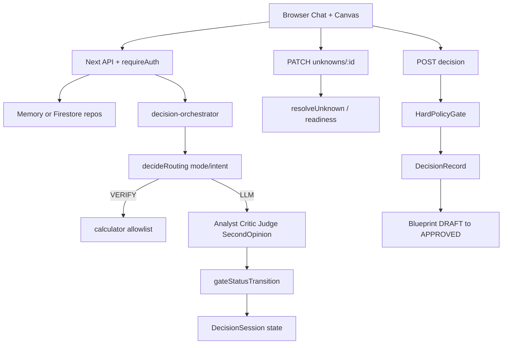

# Audit toàn diện — Layer A AI Decision Lab

- **Thời điểm:** 2026-09-10 00:21 (UTC+7)
- **HEAD:** `6df6a9b69661165dca4242a2d20ff5ba6631c641` (`main`)
- **Phạm vi:** audit-only (không sửa source); evidence scratch ngoài repo
- **Store runtime:** in-memory override trên `:3010`/`:3011` — **không** chứng minh Firestore production
- **Verdict tổng:** **BETA_PRODUCT / NOT PRODUCTION-READY**

| Điểm | Giá trị | Evidence class |
|---|---|---|
| Feature Completion | **76/100** | `VERIFIED_CODE` + `VERIFIED_TEST` + `VERIFIED_RUNTIME` |
| Production Readiness | **44/100** | hard-capped by Critical security + integrity gaps |
| AI / Decision Integrity | **58/100** | live council + false VERIFIED + confidence distortion |

A/B SecondOpinion: **`KEEP_CONDITIONAL`** (`INSUFFICIENT_DATA` for quality +5 claim; independence wiring verified).

---

## 1. Executive verdict

Layer A là lab hỗ trợ quyết định đa tác tử có cổng trạng thái thật, Unknown resolution UI, Judge draft, DecisionRecord và Blueprint — **không** phải chatbot generic. Vòng đời live `DISCOVERY → … → DECIDED → Blueprint APPROVED → export` đã khép trên session FTMO mới (`708f02fd-…`) với Gemini/Groq/DeepSeek thật.

Đồng thời, sản phẩm **chưa** sẵn sàng production: `next@15.5.9` còn Critical CVE đã vá ở `15.5.24+`; VERIFY tạo false-positive `6-8 = -2`; evidence không liên quan vẫn resolve Unknown; Blueprint vẫn nhúng API Layer A; Firestore rules production vẫn `BLOCKED_EXTERNAL`.

---

## 2. Coverage ledger

| Scope | Count / status |
|---|---|
| First-party files inventoried (`src/`, `scripts/`, `plan/`, `prompts/`, `reports/`, `.github/`) | **153** → `READ`/`SAMPLED` |
| Root configs | `READ` |
| Secrets (`.env.local`, `service.json`) | `EXCLUDED` (presence-only) |
| `node_modules` / `.next` | `GENERATED_OR_EXCLUDED` |
| Claim “đọc 100% từng dòng” | **Không** — ledger scoped; runtime `src/` ưu tiên |

**Doc drift (`VERIFIED_CODE`):** `README.md` vẫn nói Canvas không render Unknowns; `DecisionCanvas.tsx` đã wire `UnknownsPanel`. `MASTER CODING PROMPT v15` là backlog, **không** phải trạng thái đã ship.

---

## 3. Baseline tái lập

| Command | Exit | Notes |
|---|---|---|
| `pnpm lint` | 0 | clean |
| `pnpm typecheck` | 0 | clean |
| `pnpm test` | 0 | **142** tests / 18 files |
| `pnpm test:rules` | 0 | **14** emulator tests |
| `pnpm test:e2e` | 0 | **3** passed (stub models); lần 1 fail do port 3000 hỏng sau build |
| `pnpm build` | 0 | Next 15.5.9 |
| `pnpm audit --prod` | non-zero | **Critical** Next advisories GHSA-p293-qw3h-jr36 / GHSA-2xp9-vwfh-vxw4; patched ≥ **15.5.24** |
| `git diff --check` | 0 | |

---

## 4. Product / architecture map

**User-visible loop:** `/login` → workspaces → session → Mode/Intent/chat → Canvas readiness → approve → blueprint → export.

**Điểm mạnh kiến trúc:** domain/UI không import provider SDK; một cổng `gateStatusTransition`; Unknown chỉ qua endpoint riêng; SecondOpinion `allowFallback: false`; DomainPack preflight + `validateDecision`.

---

## 5. Algorithm audit (tóm tắt)

| Algorithm | Behavior | Failure / heuristic risk |
|---|---|---|
| Routing | Intent-aware; DEEP ≠ full council mỗi bước | UX dễ hiểu nhầm “DEEP = debate luôn” |
| VERIFY | Arithmetic classify + calculator | Range `6-8` → subtraction; identifier MT4 fixed earlier |
| Coverage | FULL/PARTIAL (≥0.85) | PARTIAL vẫn tạo VERIFIED evidence item |
| Confidence | Weighted heuristic | `evidence.length/5`; HIGH reliability từ false calc; `assumptionPenalty` theo count; unknown penalty từ draft stale IDs |
| Agreement | Judge label → score | Honest `UNAVAILABLE` khi không có SO |
| Approval | HardPolicyGate + `budgetExceeded: false` hard-coded | Decorative budget gate |
| Blueprint derive | Deterministic from decision | Hard-codes Layer A `/api/sessions/.../run` + Firebase/Vercel |
| Experiment complete | User results → SYSTEM/HIGH/VERIFIED | Trust inflation |

---

## 6. UI / runtime evidence

**Session:** `708f02fd-bcb5-4cc1-ac03-afb2a3562509`  
**Workspace:** `1e6489c0-2de9-4ccb-a5db-d7349161662e` (ChallengeReady)  
**DecisionRecord:** `98cecbb7-…` · `ACCEPT_WITH_CHANGES` · confidence LOW 22 · `JUDGE_HEURISTIC`  
**Blueprint:** `43051ffc-…` · `APPROVED` · export 200 (~5642 chars)

| Step | Result | Class |
|---|---|---|
| Login Firebase email/password | `/workspaces` | `VERIFIED_RUNTIME` |
| Create WS + session | FTMO problem/objective | `VERIFIED_RUNTIME` |
| DEEP FRAME→GENERATE→CRITIQUE→VERIFY→PREPARE | all HTTP 200 SSE | `VERIFIED_RUNTIME` |
| HIGH ACCEPT_RISK ×4 | 200 → readiness READY | `VERIFIED_RUNTIME` |
| PATCH DECISION_READY | 200 | `VERIFIED_RUNTIME` |
| Approve Decision (UI) | status DECIDED | `VERIFIED_RUNTIME` |
| Blueprint create/approve/export | 201/200/200 | `VERIFIED_RUNTIME` |
| Empty ACCEPT_RISK note | 400 validation | `VERIFIED_RUNTIME` |
| Unrelated VERIFIED evidence → RESOLVE_WITH_EVIDENCE | **200 RESOLVED** | `VERIFIED_RUNTIME` **defect** |
| Evidence `6-8 = -2` | VERIFIED PARTIAL | `VERIFIED_RUNTIME` **defect** |
| Canvas Options (6) near-duplicate | merge drift | `VERIFIED_RUNTIME` |
| Constraints (0) / criteria hidden | capture gap | `VERIFIED_RUNTIME` |

---

## 7. Strengths

1. **Integrity-first state machine** — Analyst/Judge không tự authorize `DECISION_READY`/`DECIDED` (`transition-gate` tests + live `transition.rejected`).
2. **Unknown workflow ship được** — UI + API + terminal resolutions; live closure sau HIGH blockers.
3. **Provider isolation design** — SecondOpinion DeepSeek-only; agreement method transparent; CI gate xanh (lint/type/unit/rules/e2e/build).

---

## 8. Weaknesses / findings

| ID | Sev | Finding | Evidence |
|---|---|---|---|
| F-01 | **Critical** | `next@15.5.9` < patched `15.5.24` (Windows RCE + AVIF RCE advisories) | `pnpm audit`, GHSA-p293-qw3h-jr36, GHSA-2xp9-vwfh-vxw4 · `VERIFIED_EXTERNAL` |
| F-02 | **Critical** | Unrelated VERIFIED evidence resolves Unknown (no `supportsUnknownIds` check) | live PATCH 200 on Kill-switch unknown using `6-8=-2` · `VERIFIED_RUNTIME`; matches v15 §4 gap in `unknown-policy.ts` · `VERIFIED_CODE` |
| F-03 | **High** | VERIFY false-positive range: “6-8 tuần” → `6-8 = -2` VERIFIED HIGH; inflates `sourceReliability=1` | Canvas + DecisionRecord factors · `VERIFIED_RUNTIME` |
| F-04 | **High** | Firestore session update still allows owner to rewrite `unknowns`/`status` (not DECIDED) | `firestore.rules` · `VERIFIED_CODE`; prod deploy IAM `BLOCKED_EXTERNAL` |
| F-05 | **High** | Manual experiment results become SYSTEM/HIGH/VERIFIED | `experimentResultDefaults()` · `VERIFIED_CODE` |
| F-06 | **Medium** | Options/assumptions duplicate across turns (6 options ≈ 3 themes × repeats) | UI session · `VERIFIED_RUNTIME` |
| F-07 | **Medium** | Constraints section empty; Analyst schema lacks constraint proposals; criteria not rendered | UI + schemas · `VERIFIED_CODE`/`RUNTIME` |
| F-08 | **Medium** | Blueprint mixes FTMO goal with Layer A APIs/Firebase/Vercel | export text · `VERIFIED_RUNTIME` + `deriveBlueprintContent` · `VERIFIED_CODE` |
| F-09 | **Medium** | `budgetExceeded: false` hard-coded in `approveDecision` | orchestrator · `VERIFIED_CODE` |
| F-10 | **Medium** | Confidence uses crude coverage and stale draft unknown IDs | orchestrator confidence block · `VERIFIED_CODE` |
| F-11 | **Low** | README Unknowns drift; auto-4-step omits PREPARE | README + Composer · `VERIFIED_CODE` |
| F-12 | **Low** | Playwright coverage thiếu Unknown closure / VERIFY regression / readiness | e2e inventory · `VERIFIED_CODE` |

---

## 9. Blind spots

1. **Production Firestore parity** chưa verify (indexes/rules deploy).
2. **Concurrency** unknown resolve lost-update chưa đo runtime.
3. **Evaluation runner** tồn tại nhưng không execute live configs trong CI.
4. **Accessibility/perf production build** chưa đo hệ thống (dev mode only for UI).
5. **Multi-tenant / team workspaces** ngoài scope hiện tại.
6. **Calibration** của heuristic confidence chưa có ground truth.

---

## 10. Completion / readiness scorecards

### Feature Completion — 76/100

| Bucket | Score | Note |
|---|---|---|
| Core lifecycle | 18/20 | Live closed |
| Structured state quality | 10/15 | dups + constraints |
| UI paths | 12/15 | Unknowns/readiness good; criteria/experiments thin |
| DomainPack | 8/10 | ChallengeReady works |
| Negative/export | 10/15 | empty note blocked; relevance bypass open |
| Docs honesty | 5/10 | README drift |
| Tests for shipped UX | 13/15 | unit/integration strong; Playwright gaps |

### Production Readiness — 44/100 (hard-capped)

Critical dependency CVE + consequential evidence/unknown bypass + undeployed rules + experiment trust inflation prevent ≥50.

| Bucket | Score | Note |
|---|---|---|
| Security baseline | 2/15 | Next Critical open |
| Data integrity | 6/15 | gates strong; relevance/Firestore client write weak |
| Persistence/ops | 4/10 | memory proven; prod Firestore blocked |
| Test/eval ops | 8/10 | CI suite green locally |
| Observability/budget | 5/10 | AgentRun cost ok; decorative budget gate |
| Perf/a11y/deploy proof | 4/10 | Vercel target; no prod verify this audit |

### AI Decision Integrity — 58/100

Council routing and agreement semantics are real; VERIFY/evidence/confidence still produce false certainty.

---

## 11. Security / data integrity

- Auth: Firebase email/password; API `requireAuth`; memory forbidden in prod runtime path (`VERIFIED_CODE`).
- `DEV_AUTH_BYPASS` off in this live audit.
- Workspace `ownerId` immutability in rules source + emulator tests; **not** confirmed on `chatai-62ca2` (`BLOCKED_EXTERNAL`).
- Session client update can still mutate business fields except a short denylist (`VERIFIED_CODE`).

---

## 12. Tests / evals

- Unit+integration 142; rules 14; e2e 3 stub — all green this run.
- Strong: transition gate, unknown policy, arithmetic classifier (MT4), structured recovery, second-opinion semantics, closure integration.
- Weak: no Playwright for Unknown UI / VERIFY range / evidence relevance; evaluation cases not wired as executable CI gate for live providers.

---

## 13. Performance / cost

| Workload | Cost |
|---|---|
| A/B n=3×2 (FRAME+GENERATE+CRITIQUE+PREPARE) | **$0.035981** |
| UI lifecycle session (approx additional) | order ~$0.01 (not fully isolated) |
| Budget cap for A/B | $0.20 — not exceeded |

A mean cost ≈ $0.0051 / run; B ≈ $0.0069 / run (~1.35×). Latency higher on B PREPARE (more calls).

---

## 14. External repository benchmark

Accessed **2026-09-09** via GitHub API (`VERIFIED_EXTERNAL`):

| Repo | Role vs Layer A | Stars / pushed | Fair compare |
|---|---|---|---|
| [langchain-ai/langgraph](https://github.com/langchain-ai/langgraph) | Stateful multi-agent + HITL interrupts | ~41k / 2026-09-09 | Framework; durable graphs — Layer A is productized decision lab |
| [crewAIInc/crewAI](https://github.com/crewAIInc/crewAI) | Role crew orchestration | ~58k / 2026-09-09 | Fast crews; weaker product decision integrity model |
| [microsoft/autogen](https://github.com/microsoft/autogen) | Conversational multi-agent | ~61k / last push 2026-04-15 | Agent chat loops; not DecisionRecord/Blueprint product |
| [promptfoo/promptfoo](https://github.com/promptfoo/promptfoo) | Eval/red-team CLI | ~25k / 2026-09-09 | Adjacent: Layer A eval harness thinner |
| [langfuse/langfuse](https://github.com/langfuse/langfuse) | Observability/evals platform | ~34k / 2026-09-09 | Adjacent: Layer A has AgentRun logs but not full OTel product |

**Positioning:** Layer A thắng ở **decision integrity productization** (gates, unknowns, human approve, immutable record). Thua frameworks ở durable orchestration ecosystem; thua Promptfoo/Langfuse ở eval/observability depth.

---

## 15. Hypotheses (falsifiable)

| ID | Hypothesis | Class | Metric |
|---|---|---|---|
| H1 | SecondOpinion tăng chất lượng quyết định ≥5/100 | tested A/B | quality delta; guardrail cost ≤1.8× |
| H2 | Chặn evidence không `supportsUnknownIds` giảm false resolve = 0 | NOW | negative API test |
| H3 | Reject hyphen ranges in VERIFY giảm false VERIFIED | NOW | zero `a-b = negative` on week ranges |
| H4 | Stable option IDs cắt duplication ≥50% | NEXT | optionCount unique themes |
| H5 | Target-specific Blueprint synthesizer tăng coding-agent usability | NEXT | export lacks Layer A paths unless chosen |
| H6 | Upgrade Next ≥15.5.24 clears Critical audit | NOW | `pnpm audit` Critical=0 for next |

---

## 16. A/B protocol + raw results

**Pre-registered:** A=`ENABLE_SECOND_OPINION=false` `:3010`; B=`true` `:3011`; n=3 interleaved; same FTMO closed-world prompt; winner needs +5 quality + no integrity regression + cost/latency guardrail.

| Run | Status | Judge | Agreement | Roles include SO? | Cost USD |
|---|---|---|---|---|---|
| A1 | VALIDATING | ACCEPT_WITH_CHANGES | UNAVAILABLE | no | 0.005342 |
| B1 | VALIDATING | missing draft | — | **yes** | 0.006588 |
| A2 | VALIDATING | missing draft | — | no | 0.004804 |
| B2 | VALIDATING | ACCEPT_WITH_CHANGES | JUDGE_HEURISTIC | **yes** | 0.007096 |
| A3 | VALIDATING | ACCEPT_WITH_CHANGES | UNAVAILABLE | no | 0.005249 |
| B3 | VALIDATING | ACCEPT_WITH_CHANGES | JUDGE_HEURISTIC | **yes** | 0.006903 |

Server call counts: A CRITIQUE≈2 / PREPARE≈5; B CRITIQUE≈3 / PREPARE≈6 — confirms independent variable.

**Blind quality +5:** not established (n=3, mixed judgeDraft success, both blocked by HIGH unknowns until human resolve).  
**Integrity:** no new SO-specific regression; VERIFY false-positive orthogonal.  
**Verdict:** **`KEEP_CONDITIONAL`**.

Raw JSON: `%TEMP%\layer-a-audit-comprehensive\ab-raw-results.json`.

---

## 17. Prioritized roadmap

### P0 — NOW
1. Upgrade Next to ≥15.5.24 (same major line).
2. Enforce evidence↔unknown relevance (`supportsUnknownIds`) + regression test.
3. Fix VERIFY hyphen/range false positives (`6-8 tuần`).
4. Deploy or explicitly quarantine Firestore rules/indexes (`BLOCKED_EXTERNAL` until IAM).

### P1 — NEXT
5. Experiment result provenance (no USER→SYSTEM VERIFIED HIGH).
6. Option/assumption stable IDs + dedupe; constraint capture + UI confirm.
7. Recompute confidence from verified-relevant factors; remove decorative `budgetExceeded:false` or wire real budget.
8. Blueprint target-project isolation + lossless rich fields.
9. Playwright Unknown closure + VERIFY regressions.

### P2 — LATER
10. Executable eval configs A–E in CI (stubs) + optional live nightly.
11. Observability export (Langfuse/OTel adjacent).
12. Atomic unknown updates / OCC.

### P3 / DO_NOT_BUILD
- Thêm provider/agent chỉ vì trend.
- Claim “100/100 Verified” trước khi hard gates v15 đóng.

---

## 18. Blockers

| Blocker | Status |
|---|---|
| Firestore rules/indexes IAM on `chatai-62ca2` | `BLOCKED_EXTERNAL` |
| Next Critical patch not applied in lockfile | open (in-repo version choice) |
| Production persistence proof | `NOT_TESTED` this audit (memory only) |

---

## 19. Evidence appendix

- Scratch: `C:\Users\Kieu Oanh\AppData\Local\Temp\layer-a-audit-comprehensive\`
  - `evidence-manifest.json`, `file-manifest.txt`, baseline `*.txt`/`*.meta.txt`
  - `ab-raw-results.json`, `ab-summary.json`, `server-a-off.log`, `server-b-on.log`
- Prior QA context (regression hypotheses only): `reports/26-09-08-01-22-kiem-thu-e2e-ftmo-decision-session-reeval.md`
- Spec backlog: `prompts/MASTER CODING PROMPT v15 — Integrity Closure and Release Candidate.md`

---

## 20. Bottom line for management

**Đã chứng minh:** lab quyết định đa tác tử chạy E2E thật; cổng trạng thái và Unknown UI hoạt động; SecondOpinion độc lập đo được; CI nội bộ xanh.

**Chỉ suy luận / mẫu nhỏ:** SecondOpinion chưa chứng minh +5 chất lượng.

**Bị chặn:** Firestore production parity; không audit deploy Vercel live.

**Chạy tiếp ngay:** patch Next; đóng evidence-relevance + range VERIFY; rồi mới nói production.
