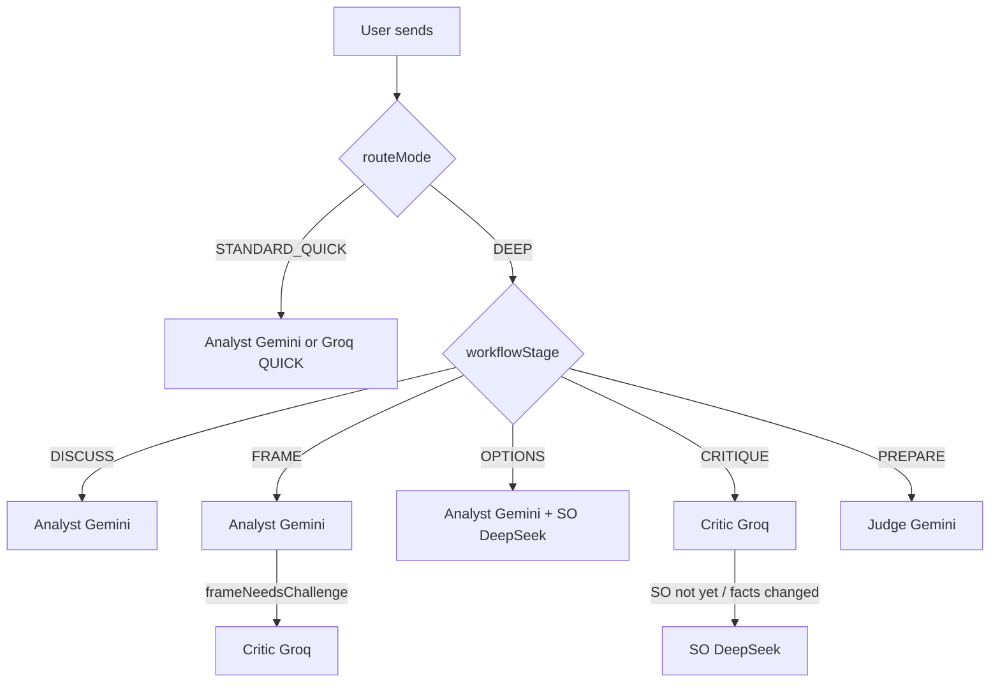

# Audit DEEP multi-provider & chất lượng tranh luận

- **Thời điểm:** 2026-09-10 ~02:55 (UTC+7)
- **Phạm vi:** RCA — vì sao UI chỉ thấy Gemini; trạng thái Groq/DeepSeek; vì sao “tranh luận” trông tẻ nhạt
- **Không sửa code trong pass này** (audit only)

## Verdict (1 câu)

API Groq/DeepSeek **đã cấu hình**; “chỉ Gemini” chủ yếu vì **ma trận Mode×Stage + Intent DISCUSS/`Gửi`** chỉ gọi Analyst (Gemini), chưa tới OPTIONS/CRITIQUE/PREPARE — cộng UX chat chỉ hiện monologue `reply`, không bề mặt đối thoại đa vai.

## 1. API / env (không lộ secrets)

| Biến | Trạng thái local `.env.local` | Hiệu lực |
|---|---|---|
| `GEMINI_API_KEY` | SET | Analyst / Judge (và Critic fallback) |
| `GROQ_API_KEY` | SET | Critic preferred |
| `DEEPSEEK_API_KEY` | SET | SecondOpinion only (`allowFallback: false`) |
| `ENABLE_CRITIC` | `true` | Critic bật |
| `ENABLE_JUDGE` | `true` | Judge bật |
| `ENABLE_SECOND_OPINION` | MISSING → default **on** (`!== false`) | SO bật khi có DeepSeek |
| `USE_STUB_MODELS` | MISSING → false | Gọi API thật |

**Kết luận env:** Không phải thiếu key. Cả 3 provider sẵn sàng về cấu hình.

Provider registry (`src/ai/gateway/model-registry.ts`):

- Gemini → `gemini-3.6-flash`
- Groq → `openai/gpt-oss-120b`
- DeepSeek → `deepseek-chat`

Role → preferred provider (`resolveProviderForRole`):

- QUICK → groq (Analyst economy)
- CRITIC → groq (fallback gemini → deepseek)
- ANALYST / JUDGE → gemini
- SECOND_OPINION → **luôn** `deepseek`, không fallback (tránh Gemini tự so sánh với Gemini)

## 2. Thuật toán routing (nguyên nhân chính “chỉ Gemini”)

Nguồn sự thật: `decideRouting()` trong [`src/ai/orchestration/execution-plan.ts`](../src/ai/orchestration/execution-plan.ts).

### Ma trận DEEP (v17)

| Stage | Agent chạy | Provider kỳ vọng |
|---|---|---|
| DISCUSS | Analyst only | Gemini |
| FRAME | Analyst (+ Critic **chỉ khi** `frameNeedsChallenge`) | Gemini (+ Groq) |
| OPTIONS | Analyst **+** SecondOpinion song song | Gemini + DeepSeek |
| CRITIQUE | Critic (+ SO nếu chưa contribute / facts đổi) | Groq (+ DeepSeek) |
| VERIFY | Tools (+ optional Analyst giải thích DEEP) | — / Gemini |
| PREPARE | **Judge only** | Gemini |

STANDARD/QUICK: **luôn Analyst-only** dù stage nào (trừ VERIFY = tools).

### `frameNeedsChallenge` (FRAME Critic)

```ts
highUnknownCount >= 2 || (problem.trim().length < 80 && constraints.length === 0)
```

Framing dài/có structure thường **không** kéo Critic vào FRAME.

### Client UX làm lệch kỳ vọng “hội đồng”

| Hành vi UI | Intent/stage | Kết quả |
|---|---|---|
| Default `routeMode` = **STANDARD** | Analyst-only | Không bao giờ Critic/SO/Judge |
| Nút **Gửi** | `intent` mặc định **DISCUSS** (không `autoIntent`) | DEEP vẫn **1 call Analyst** |
| Nút **Bắt đầu phân tích** | `autoIntent: true` → StageController | Mới lần lượt FRAME→OPTIONS→… |
| Timeline empty copy | “Analyst → Critic → Judge” | **Lệch v17** (OPTIONS mới có SO; PREPARE = Judge only) |

### Bằng chứng runtime (dev server hiện tại)

Session `uPcRDrZYsrGeNwfzbhoO` (terminal `199016`):

```text
orchestrator.completed routeMode=STANDARD calls=1 workflowStage=DISCUSS
orchestrator.completed routeMode=DEEP     calls=1 workflowStage=DISCUSS
```

Khớp thiết kế: DEEP + DISCUSS = **đúng 1 Gemini call**. Không phải Groq/DeepSeek “chết”.

## 3. Khi nào Groq / DeepSeek xuất hiện (và khi nào “biến mất”)



**Im lặng khi fail:** Critic/SO/Judge lỗi → `AgentRun` FAILED + SSE `run.partial`, **không** `messages.create` → chat không có bubble → cảm giác “chỉ Gemini” dù đã thử gọi.

**Pause sau OPTIONS:** HIGH unknowns / EXPERIMENT / HUMAN_DECISION → workflow PAUSED → chưa tới CRITIQUE/PREPARE → chưa thấy Critic/Judge.

**skipRemainder** sau Analyst (budget / experiment / human-required flags) → bỏ SO đang chạy và Critic/Judge.

## 4. Vì sao tranh luận trông tẻ nhạt

Đây là **hợp chất thiết kế + prompt + UI**, không chỉ “model kém”.

### 4.1 Không phải debate đồng thời trên mỗi tin

Mỗi bước chat thường = **một vai** (Analyst). “Tranh luận” chỉ xuất hiện khi pipeline đã tới OPTIONS/CRITIQUE/PREPARE — và thường **tuần tự theo stage**, không phải hội đồng cùng một bubble turn.

### 4.2 Prompt Analyst thiên về inventory

`ANALYST_BASE_V1`: frame / assumptions / unknowns / options / constraints → output chat là **tóm tắt có cấu trúc** (đúng lab quyết định), không phải sparring.

### 4.3 Critic/SO có trách nhiệm “đánh”, nhưng bề mặt UI mỏng

- Chat chỉ render `message.content` (= field `reply`) — [`MessageBubble.tsx`](../src/features/chat/MessageBubble.tsx).
- Schema Critic: `criticisms[]`, `unsupportedAssumptions[]`, `missingEvidence[]` — **không** được panel Decision Canvas hiển thị riêng (grep canvas: không có).
- SO `independentOptions` / `divergentRisks` merge vào options (`proposedBy: SECOND_OPINION`) nhưng chat vẫn là một đoạn `reply` dạng báo cáo.
- `DebateTimeline` chỉ là chip role A→B, không diff quan điểm / điểm bất đồng.

### 4.4 Copy UX lệch kỳ vọng

- Footer DEEP: “Analyst + SecondOpinion + Critic + Judge theo giai đoạn” — đúng nhưng user hiểu thành “mỗi lần Gửi đều đủ hội đồng”.
- Timeline empty: hứa Critic/Judge ngay sau gửi — **sai với DISCUSS/FRAME**.

### 4.5 PREPARE không còn “full council”

v17 cố ý: PREPARE = Judge only trên artifact cũ → giảm cost/redundant calls, nhưng giảm cảm giác “hội đồng chốt” trong chat lúc cuối.

## 5. Phân loại nguyên nhân

| ID | Mức | Loại | Mô tả |
|---|---|---|---|
| R1 | P0 (nhận thức) | By design | DEEP DISCUSS/FRAME = Analyst-only; `Gửi`+DISCUSS giải thích screenshot “chỉ ANALYST gemini” |
| R2 | P0 (nhận thức) | UX | Default Mode STANDARD; CTA auto vs Gửi không rõ “khi nào có đa provider” |
| R3 | P1 | Product/UX | Structured criticisms/divergence không surface; chat = monologue |
| R4 | P1 | Copy | DebateTimeline / footer overpromise full council mỗi turn |
| R5 | P2 | Observability | Fail SO/Critic chỉ `run.partial` — user không thấy “DeepSeek failed” trong chat |
| R6 | P2 | Prompt | Critic/SO đủ hướng dẫn nhưng thiếu format “điểm bất đồng / phản bác trực tiếp option X” bắt buộc trong `reply` |

**Không phải:** thiếu `GROQ_API_KEY` / `DEEPSEEK_API_KEY` trên máy local hiện tại.

## 6. Đề xuất (chưa implement)

### P0 — làm đúng kỳ vọng không weaken gate

1. Khi Mode=DEEP và user bấm **Gửi** ở early stage: banner/chip “Bước này chỉ Analyst (Gemini). Critic/DeepSeek chạy ở OPTIONS/CRITIQUE — dùng **Bắt đầu phân tích**.”
2. Sửa copy DebateTimeline empty + RouteModeHint cho khớp ma trận v17.
3. Sau mỗi run: chip `executionPlan.stages` đã chạy (ANALYST / SECOND_OPINION / …) kể cả khi fail (`run.partial` hiển thị role+lỗi ngắn).

### P1 — “tranh luận” cảm nhận được

1. Panel **Điểm bất đồng**: Critic criticisms + SO divergentRisks + Judge agreement label.
2. Trong chat bubble Critic/SO: prefix bắt buộc (prompt) dạng “Phản bác Analyst: … / Phương án khác: …”.
3. Badge option `proposedBy` (ANALYST vs SECOND_OPINION) trên Decision Canvas.
4. Optional: DEEP `Gửi` map sang StageController (`autoIntent`) thay vì kẹt DISCUSS — **cân nhắc UX** (mọi tin nhắn sẽ advance pipeline).

### P2 — live verify

1. Một seed FTMO: chạy **Bắt đầu phân tích** Mode DEEP; xác nhận `calls≥2` ở OPTIONS (gemini+deepseek) và Critic groq ở CRITIQUE.
2. Log bảng: role / provider / model / status / tokens / cost / có bubble?

## 7. Ràng buộc giữ nguyên

- Không auto-approve Decision.
- Không weaken `gateStatusTransition` / unknown-policy / HardPolicyGate.
- Không biến VERIFY thành LLM-trust.
- SecondOpinion vẫn `allowFallback: false` trên deepseek.

## 8. Files đối chiếu

- [`src/ai/orchestration/execution-plan.ts`](../src/ai/orchestration/execution-plan.ts) — Mode×Stage
- [`src/domain/decision/workflow-stage.ts`](../src/domain/decision/workflow-stage.ts) — StageController
- [`src/ai/gateway/model-gateway.ts`](../src/ai/gateway/model-gateway.ts) — provider resolve/fallback
- [`src/ai/agents/second-opinion.ts`](../src/ai/agents/second-opinion.ts) — DeepSeek only
- [`src/ai/prompts/registry.ts`](../src/ai/prompts/registry.ts) — role prompts
- [`src/app/(app)/sessions/[sessionId]/page.tsx`](../src/app/(app)/sessions/[sessionId]/page.tsx) — Gửi vs autoIntent
- [`src/features/chat/DebateTimeline.tsx`](../src/features/chat/DebateTimeline.tsx) — copy lệch
- [`reports/26-09-10-02-37-automatic-decision-workflow-v17.md`](./26-09-10-02-37-automatic-decision-workflow-v17.md) — ma trận v17 đã ghi
