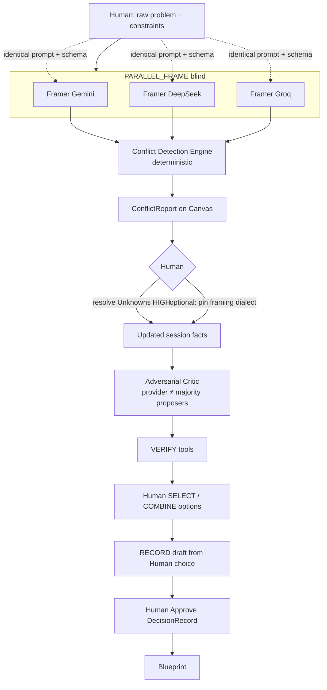

# Architectural Redesign Blueprint — Parallel Multi-Model Council

- **Repo:** `howtodonextcom-art/260907-AI-Chatbot`
- **Time:** 2026-09-10 20:39 (UTC+7)
- **Role:** Principal Multi-Agent Systems Architect (Game Theory / Anti-Bias / HITL)
- **Evidence base:** source forensics (`execution-plan.ts`, `workflow-stage.ts`, `model-gateway.ts`, `decision-orchestrator.ts`) + live Mega 6/45 debug session (`debug-74ad39.log`, MCP browser)
- **Status:** Design blueprint — **not implemented** in this pass (no hard-gate weakening)

---

## Phần 1 — Framing Bias Audit (lỗ hổng định khung)

### 1.1 Point of Failure trong Stage hiện tại

Luồng DEEP **không** phải “3 API cùng tranh luận từ đầu”. Nó là **pipeline giai đoạn**, và quyền định nghĩa không gian bài toán nằm gần như hoàn toàn ở Gemini:

| Stage | Ai chạy (code) | Provider | Nhìn thấy gì |
|---|---|---|---|
| DISCUSS / FRAME | Analyst only | `gemini` (DEEP) | Raw human + session |
| OPTIONS | Analyst ∥ SecondOpinion | gemini ∥ deepseek | SO **mù Analyst output**, nhưng đã ăn **canonical session state** do FRAME ghi (`latestSummary`, assumptions seed…) |
| CRITIQUE | Critic (± SO re-run) | groq | Nhìn Analyst + SO artifacts |
| PREPARE | Judge only | **gemini** | Chọn option → `judgeDraft` |

**Nguồn “ưu ái Gemini” (không phải bug key):**

1. **`decideRouting` (`execution-plan.ts`)** — DEEP `FRAME` / `DISCUSS` cố ý `runSecondOpinion:false`, `runCritic` chỉ khi `frameNeedsChallenge` (heuristic: ≥2 HIGH unknowns **hoặc** problem ngắn + 0 constraints). Mega 6/45 runtime: `frameNeedsChallenge:false` → Critic cũng không vào FRAME.
2. **`decideWorkflowStage` (`workflow-stage.ts`)** — `hasFraming` = có `latestSummary`. FRAME của Analyst ghi summary → StageController coi bài toán đã “được khung” → nhảy OPTIONS. Không có artifact “multi-frame”.
3. **`resolveProviderForRole` (`model-gateway.ts`)** — Analyst (non-QUICK) **và** Judge đều prefer `"gemini"`. Critic = groq; SecondOpinion hard-lock deepseek. Không có rotation / blind identity.
4. **Merge semantics** — `applyAnalystState` đổ options/assumptions/unknowns của Analyst vào Decision Canvas như **canonical**. SO chỉ **append** options (`proposedBy: SECOND_OPINION`) và `debateNotes` — không được quyền viết lại framing ngang hàng.

**Runtime chứng minh (Mega 6/45, session `cwinEkxmsC4WM9XUfzMm`):**

- Turn 1 FRAME: `runSecondOpinion:false`, `runCritic:false`, `hasDeepseek:true`, `hasGroq:true` → chỉ Analyst.
- Turn 2 OPTIONS: DeepSeek COMPLETED, 6 options (3 ANALYST + 3 SO), “Điểm bất đồng” xuất hiện — **nhưng SO phản biện trên nền đã được Analyst khung**.
- Turn 3 CRITIQUE: Groq COMPLETED dù 3 HIGH unknowns OPEN (đúng v19) — Critic đánh giá **sau** khi không gian bài toán đã neo.

### 1.2 Rủi ro FRAME(Gemini) + JUDGE(Gemini)

Đây là **cùng một nhà cung cấp** đóng hai vai có quyền lực bất đối xứng:

| Vai | Quyền lực | Rủi ro thiên lệch |
|---|---|---|
| Analyst @ FRAME | Định nghĩa problem framing, seed assumptions/unknowns, vocabulary của options | **Anchoring** — mọi agent sau phải nói trong “ngôn ngữ” của khung này |
| Judge @ PREPARE | `selectedOptionTitle` → `judgeDraft` → Human chỉ Approve/Reject gần như binary trên draft | **Self-preference / egocentric bias** (literature: same-model judge ưu tiên output “cùng họ”); `agentAgreement` còn lấy từ Judge label (`JUDGE_HEURISTIC`) |

Hard gates hiện tại **bảo vệ pháp lý** (Human phải `approveDecision` sau `HardPolicyGate`; không auto-`DECIDED`) nhưng **không bảo vệ nhận thức**: Human phê duyệt một draft đã được Gemini khung + Gemini chọn.

**Kết luận Phần 1:** Điểm mù không phải “DeepSeek/Groq lỗi API”. Điểm mù là **thiết kế Mode×Stage trao monopoly framing + monopoly draft-selection cho cùng provider**. Tranh luận hiện tại là *sequential challenge trên neo Gemini*, không phải *parallel independent framing trên raw problem*.

---

## Phần 2 — Parallel Council Flowchart & State Machine

### 2.1 Nguyên tắc thiết kế (Game Theory / Anti-Bias)

1. **Common knowledge = raw human input only** ở vòng 1 (problem, objective, constraints tường minh). Không agent nào thấy output agent khác.
2. **Collision trước synthesis** — Conflict Detection là **deterministic** (không LLM), để tránh “judge tự hòa giải” sớm.
3. **Human = sovereign selector**; AI council = proposal generators + adversarial critics; Judge LLM (nếu còn) chỉ **ghi nhận** lựa chọn Human, không chọn thay.
4. **Giữ nguyên hard gates:** `gateStatusTransition`, unknown-policy terminal resolutions, `HardPolicyGate`, no auto-`DECIDED`, VERIFY tool-first.

### 2.2 State machine đề xuất (thêm / đổi nghĩa stage)

```text
WorkflowStage' (proposal):

  INTAKE          — Human: problem + constraints + criteria weights (optional)
       │
       ▼
  PARALLEL_FRAME  — N≥2 Framers độc lập (gemini, deepseek, groq), blind
       │            mỗi agent → FrameBrief { framing, assumptions, unknowns, options[] }
       ▼
  CONFLICT        — Deterministic Conflict Detection Engine (no LLM)
       │            → ConflictReport { disagreementClusters, sharedAssumptions,
       │                               blockingUnknownUnion, optionFrontier }
       ▼
  HUMAN_ARBITRATE — PAUSED: Human resolve HIGH unknowns + optionally reweight criteria
       │            / pick framing dialect (or keep multi-frame visible)
       ▼
  ADVERSARIAL     — Critic(s) attack option frontier (may rotate provider ≠ proposers)
       │
       ▼
  VERIFY          — tools only (unchanged semantics)
       │
       ▼
  HUMAN_SELECT    — Human SELECT | COMBINE | REJECT options (binding)
       │
       ▼
  RECORD          — Draft DecisionRecord from Human choice (LLM optional scribe)
       │            Human approve → DECIDED → Blueprint
       ▼
  (DECIDED / ARCHIVED)
```

**Mapping tương thích ngược (migration):**

| Stage cũ | Stage mới | Ghi chú |
|---|---|---|
| DISCUSS/FRAME | INTAKE + PARALLEL_FRAME | FRAME không còn Analyst-only |
| OPTIONS | gộp vào PARALLEL_FRAME outputs | Options mang `proposedBy` + `frameId` |
| CRITIQUE | ADVERSARIAL | Sau Human đã thấy ConflictReport |
| VERIFY | VERIFY | Giữ nguyên |
| PREPARE | HUMAN_SELECT + RECORD | Judge không còn “chọn” |

### 2.3 Workflow diagram (Parallel Framing → Conflict)



### 2.4 Conflict Detection Engine (logic, không LLM)

Input: `FrameBrief[]` từ N framer.

Output `ConflictReport`:

| Signal | Thuật toán gợi ý | Mục đích |
|---|---|---|
| `framingDivergence` | embedding/cosine **hoặc** Jaccard trên key claims (deterministic keyword+structure trước) | Neo khác nhau thế nào |
| `assumptionConflicts` | cùng claim khác polarity / status | Bất đồng giả định |
| `unknownUnion` | union + importance max; đánh dấu unknown chỉ 1/N agent nêu | Điểm mù tập thể |
| `optionClusters` | normalize title + token overlap; cluster → “cùng hướng” vs “đối lập” | Tránh 8 option ảo = 3 hướng thật |
| `paretoFrontier` | nếu Human đã set criteria weights: non-dominated options | Chuẩn bị HUMAN_SELECT |

**Cấm:** LLM Judge gọi sớm để “tóm tắt hội đồng” trước khi Human thấy ConflictReport — đó chính là tái tạo anchoring.

### 2.5 Blindness contract (bắt buộc trong orchestrator)

Giống SecondOpinion hiện tại (`allowFallback:false`, parallel promise), nhưng **mở rộng cả 3 framer**:

- Cùng `userRequest` thô + constraints; **không** inject `latestSummary` của agent khác.
- Không await tuần tự rồi đưa output A vào prompt B.
- Schema thống nhất `CouncilFrameOutput` (framing, assumptions, unknowns, options, recommendedDirection).
- Fail một provider → partial council + `run.partial` tường minh (không fallback sang Gemini cho slot DeepSeek — tránh “giả độc lập”).

---

## Phần 3 — Human-In-The-Loop Interaction Matrix

### 3.1 Vai trò Human (định nghĩa rõ)

Human **không** chỉ là “người prompt chat”. Human là:

| Vai | Quyền | Node Canvas |
|---|---|---|
| **Problem Owner** | Viết/sửa Overview, Objective, Constraints | Overview, Constraints |
| **Epistemic Arbiter** | Đóng Unknowns (`RESOLVE_WITH_EVIDENCE` / `HUMAN_DECISION` / `ACCEPT_RISK`) | UnknownsPanel |
| **Selector / Combiner** | Chọn 1 option, hoặc COMBINE (tạo option mới từ 2+), hoặc REJECT all → re-run PARALLEL_FRAME | Options (+ UI mới Select/Combine) |
| **Legal Approver** | `approveDecision` → `DECIDED`; duyệt Blueprint | Decision, Blueprint |
| **Budget Governor** | Mode QUICK/STANDARD/DEEP; dừng workflow | Mode, Composer Stop |

AI Council **không** được tự `DECIDED`, không tự đóng HIGH unknown bằng prose, không tự COMBINE thành canonical nếu Human chưa xác nhận.

### 3.2 Quy trình 4 bước (map vào Node)

```text
B1 Human  → INTAKE: problem + constraints (+ optional criteria weights)
B2 Council → PARALLEL_FRAME → CONFLICT → Canvas: ConflictReport, Options*, Unknowns*
B3 Human  → resolve Unknowns; SELECT/COMBINE hướng đi
B4 Council → ADVERSARIAL + VERIFY → tối ưu chi tiết option đã chọn → RECORD → Blueprint (sau approve)
```

### 3.3 Ma trận Node × Actor

| Decision Canvas Node | AI viết nháp | Human bắt buộc | Gate cứng |
|---|---|---|---|
| Overview / Objective | Có thể refine sau HUMAN_ARBITRATE | Sở hữu bản gốc | — |
| Constraints | AI đề xuất `AI-proposed` | Accept / edit / delete | — |
| Unknowns | Union từ N framer | Resolve HIGH trước DECISION_READY | `unknown-policy` / `canEnterDecisionReady` |
| ConflictReport | Deterministic engine | Đọc + quyết định trọng số | — |
| Options | N framer + provenance | SELECT / COMBINE / REJECT | Không Judge tự chọn |
| Assumptions | N framer | Xác nhận / contradict | VERIFY + status |
| Evidence | Tools VERIFY | — | Coverage FULL mới auto-SUPPORTED |
| Experiments | AI đề xuất | Human chạy/đóng | — |
| Decision Record | Scribe draft từ Human choice | Approve | `HardPolicyGate` |
| Blueprint | Derive từ Decision | Approve | Status DRAFT→APPROVED |

### 3.4 Điểm mơ hồ hiện tại → làm rõ

| Hiện trạng | Sau redesign |
|---|---|
| Human chat “hỏi đáp” bị hiểu như FRAME Analyst | Chat ở INTAKE chỉ bổ sung constraints/facts; không thay Parallel Frame trừ khi Human bấm “Chạy hội đồng” |
| Human giải Unknown nhưng không chọn option | Thêm bước HUMAN_SELECT bắt buộc trước RECORD |
| Human Approve = tin Judge Gemini | Approve = xác nhận **lựa chọn của chính Human** (draft chỉ transcription) |

---

## Phần 4 — Đề xuất sửa đổi Codebase cụ thể

### 4.1 Domain (`src/domain/decision/`)

| File | Thay đổi |
|---|---|
| `types.ts` | Thêm `WorkflowStage`: `INTAKE`, `PARALLEL_FRAME`, `CONFLICT`, `HUMAN_ARBITRATE`, `HUMAN_SELECT`, `RECORD` (hoặc map alias trong 1 phiên bản chuyển tiếp). Thêm `FrameBrief`, `ConflictReport`, `OptionProvenance { agentRole, provider, frameId }`. Option: `selectionStatus: PROPOSED \| SHORTLISTED \| SELECTED \| MERGED \| REJECTED`. |
| `workflow-stage.ts` | `decideWorkflowStage`: sau INTAKE → PARALLEL_FRAME nếu thiếu N FrameBrief CURRENT; sau PARALLEL_FRAME → CONFLICT (pure); pause `HUMAN_ARBITRATE` khi HIGH unknowns; **không** PREPARE cho đến `HUMAN_SELECT` có SELECTED/MERGED. |
| `debate-notes.ts` | Mở rộng hoặc thay bằng `ConflictReport` làm substrate Canvas (giữ `debateNotes` như view adapter). |
| `unknown-policy.ts` | `unknownUnion` importance = max across framers; provenance `raisedBy[]`. **Không** nới lỏng terminal resolutions. |
| `state-machine.ts` | `canEnterDecisionReady`: thêm điều kiện `hasHumanSelectedOption` (SELECTED hoặc MERGED). Giữ chặn `DECIDED` ngoài `approveDecision`. |
| `schemas.ts` | PATCH session không cho client ghi đè `conflictReport` / `frameBriefs` tùy tiện (tương tự unknowns). |
| **new** `conflict-engine.ts` | Pure functions: cluster options, assumption conflicts, framing divergence score, pareto frontier. |
| **new** `option-selection.ts` | `selectOption`, `combineOptions`, `rejectOptions` — single authority giống `resolveUnknown`. |

### 4.2 Orchestration (`src/ai/orchestration/`)

| File | Thay đổi |
|---|---|
| `execution-plan.ts` | DEEP `PARALLEL_FRAME`: `runFramerGemini`, `runFramerDeepseek`, `runFramerGroq` (hoặc generic `runCouncilFramers[]`) — **không** `runAnalyst` đơn. Bỏ monopoly FRAME. PREPARE/RECORD: `runJudge` mặc định **false** hoặc `runScribe` không được `selectedOptionTitle` từ LLM. |
| `decision-orchestrator.ts` | Fan-out 3 framer parallel (pattern SO hiện tại). Không merge Analyst-first vào `latestSummary` trước khi cả 3 xong. Sau đó gọi `buildConflictReport`. Critic chỉ sau HUMAN_ARBITRATE (hoặc sau CONFLICT nếu Human bật auto-critique). `approveDecision` path: `selectedOptionId` **bắt buộc từ session.humanSelection**, không từ Judge. |
| `model-gateway.ts` | `resolveProviderForRole`: tách `FRAMER_A/B/C` → gemini/deepseek/groq; **cấm** Judge/Scribe dùng cùng provider với framer thắng cuộc nếu còn LLM scribe (hoặc bỏ LLM chọn). |
| **new** `council-framer.ts` (agents) | Một schema `CouncilFrameOutput`; 3 provider adapters. |
| Agents `judge.ts` | Thu hẹp: chỉ `transcription` + risk checklist; **xoá** quyền chọn option (hoặc deprecate). |

### 4.3 UI / API (tối thiểu để HITL đủ nghĩa)

| Khu vực | Thay đổi |
|---|---|
| `UnknownsPanel.tsx` | Giữ; nhấn mạnh bước B3 trước Select |
| **new** `ConflictPanel.tsx` | Render ConflictReport |
| **new** `OptionSelectBar.tsx` | SELECT / COMBINE / REJECT |
| `Composer.tsx` / hints | “Gửi hỏi đáp” ≠ “Chạy hội đồng song song”; CTA riêng `Chạy hội đồng` |
| API | `PATCH .../options/selection` (single authority); không cho Judge route tự set selected |

### 4.4 Synthesis & Selection Engine (trả lời câu 8 options)

**Không** để Judge Gemini “chấm và chọn”. Pipeline:

1. **Cluster** (Conflict Engine) → 8 options → ~K hướng (K≪8).
2. **Score deterministic** (nếu có criteria): weighted sum / Pareto — chỉ để **xếp hạng tham khảo**, không auto-select.
3. **Human SELECT hoặc COMBINE** (binding) → `humanSelection`.
4. **RECORD**: copy fields vào DecisionRecord; LLM scribe tối đa viết `rationale` **có cite** option ids Human chọn; HardPolicyGate + Human approve.

**Loại bỏ thiên vị Judge:**

| Biện pháp | Mức |
|---|---|
| Human binding selection trước draft | **Bắt buộc (P0 redesign)** |
| Judge không còn `selectedOptionTitle` | P0 |
| Nếu còn LLM scribe: provider ≠ winner framer; hoặc stub/template | P1 |
| `agentAgreement` từ Conflict Engine overlap metrics, không từ Judge self-label | P1 |
| Optional: rotating blind auditor chỉ gắn cờ rủi ro, không chọn | P2 |

### 4.5 Feature flag & Mode tương thích

| Mode | Hành vi đề xuất |
|---|---|
| QUICK | 1 framer (groq) — chấp nhận anchoring để rẻ |
| STANDARD | 1–2 framer; Human select vẫn bắt buộc trước DECIDED |
| DEEP | N=3 parallel framer + Conflict Engine + HITL đầy đủ |

Flag: `ENABLE_PARALLEL_COUNCIL` (default off đến khi test xanh) — không phá FTMO E2E hiện tại.

### 4.6 Ràng buộc không đụng

- Không làm yếu `gateStatusTransition` / unknown terminal / HardPolicyGate.
- Không auto-approve DECIDED.
- VERIFY vẫn tool-first.
- Không commit secrets; identity push vẫn `howtodonext.com` khi user yêu cầu ship.

### 4.7 Thứ tự triển khai gợi ý

1. Domain types + `conflict-engine.ts` + `option-selection.ts` + tests thuần.
2. Orchestrator parallel framers + flag DEEP.
3. Canvas ConflictPanel + OptionSelectBar + API selection.
4. Thu hẹp Judge → scribe; chuyển `approveDecision` sang `humanSelection`.
5. Live MCP Mega 6/45: chứng minh 3 FrameBrief trước mọi merge; Human select trước Decision.

---

## Tóm tắt điều hành

| Câu hỏi | Trả lời |
|---|---|
| Vì sao Gemini “độc quyền” FRAME? | `decideRouting` + StageController + merge Analyst-first — **by design cũ**, không phải mất key |
| Tranh luận hiện tại có bình đẳng? | **Không** ở tầng framing; chỉ bình đẳng tương đối ở OPTIONS (SO blind) và CRITIQUE (Groq) **sau neo** |
| Human là gì? | Sovereign: constraints, unknowns, **option select/combine**, legal approve — không chỉ prompting |
| 8 options xử lý sao? | Cluster → score tham khảo → **Human SELECT/COMBINE** → RECORD; **không** Judge tự chọn |
| Làm sao hết bias Judge? | Tách selection khỏi LLM cùng provider với Framer; Human binding trước draft |

**Next (khi user OK implement):** MASTER CODING PROMPT triển khai `ENABLE_PARALLEL_COUNCIL` theo §4.7, kèm test + MCP gate PASS trên Mega 6/45.
